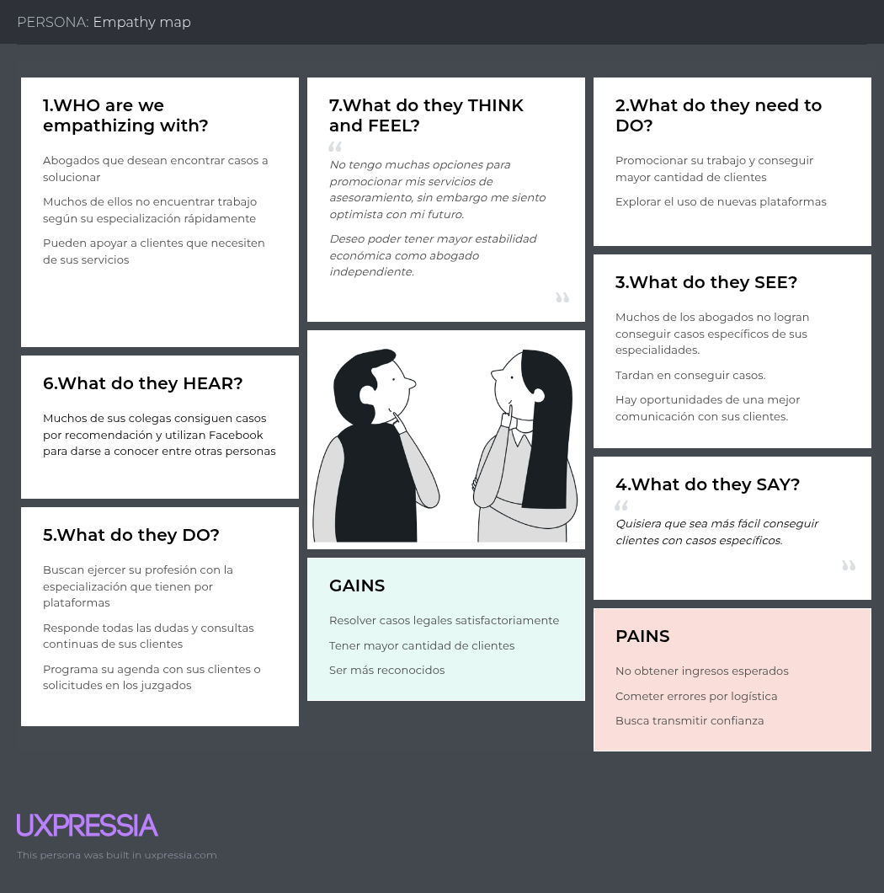

  
  
  
Universidad Peruana de Ciencias Aplicadas  
  
Carrera: Ingeniería de Software  
  
Ciclo: 2025-02  
  
Curso: Fundamentos de Arquitectura de Software   
  
Sección: 1ASI0657 
  
Profesor: Jorge Luis Delgado Vite 
  
Informe del Trabajo Final - TP
  
Startup: Law Connect
  
Producto: Law Connect

### Team Members:

| Member                                | Code       |
|---------------------------------------|------------|
| Paitan Pumacahua, Max Anthony         | U201314454 |
| Conde Isla, Camila Alessandra       | U202114309 |
| Pariona Lucas, Jose Manuel         | U202119257 |
| Méndez Vargas, Sebastian       | U20201F140 |
| Góngora Sánchez, Marco Antonio          | U20211A085 |

  
**Setiembre del 2025**

  
---  
# Registro de Versiones del Informe  

  
| Versión | Fecha      | Autor   | Descripción de modificaciones         |
|---------|------------|---------|---------------------------------------|
| 1.0     | 12/09/2025 | Paitan Pumacahua, Max Anthony  	Conde Isla, Camila Alessandra	  Pariona Lucas, Jose Manuel	  Méndez Vargas, Sebastian   Góngora Sánchez, Marco Antonio | Capítulo I   Capítulo II   Capítulo III       |

---  
# Project Report Collaboration Insights  

Se presenta el procedimiento seguido para la elaboración del informe en cada una de las entregas, acompañado de capturas de pantalla que evidencian los análisis de colaboración y los registros de commits realizados en GitHub dentro del repositorio correspondiente al informe.

**URL del Repositorio del Informe:** https://github.com/UPC-PRE-202502-1ASI0657-2520-6336/Report/tree/main

**Entrega N°1: TB1:**

Las tareas correspondientes a la entrega TB1 se completaron en el repositorio de GitHub de la organización del equipo, disponible en el enlace de repositorio del informe.

Para la elaboración del informe se llevaron a cabo las siguientes acciones:

Cada integrante del equipo redactó su parte y elaboró gráficos en formato Markdown de acuerdo con los puntos asignados, registrando posteriormente los avances mediante commits en el repositorio.

Se generaron los artefactos requeridos utilizando las herramientas sugeridas, y las imágenes necesarias se obtuvieron a través de la opción de Issues dentro del repositorio del informe.

Se realizaron reuniones periódicas para coordinar el desarrollo de los apartados del informe, las cuales también sirvieron para compartir el progreso alcanzado en cada etapa.

**Contributors Insigts report:**

Contributors Insights Report:

https://github.com/UPC-PRE-202502-1ASI0657-2520-6336/Report/graphs/contributors

Networks Insights report:

https://github.com/UPC-PRE-202502-1ASI0657-2520-6336/Report/network

---  
# Student Outcome  
El curso contribuye al cumplimiento del Student Outcome ABET: **ABET – EAC - Student Outcome 7**   Criterio:   
  
En el siguiente cuadro se describe las acciones realizadas y enunciados de conclusiones por parte del grupo, que permiten sustentar el haber alcanzado el logro del ABET – EAC - Student Outcome 7.  

| Criterio específico | Acciones realizadas | Conclusiones |
| - | - | - |
| Criterio 1: Actualiza conceptos y conocimientos necesarios para su desarrollo profesional y en especial para su proyecto en soluciones de software. | ***TB1:***   **Paitan Pumacahua, Max Anthony**    Yo realicé lo siguiente:   - Definí los Lean UX Assumptions, estructurando las hipótesis iniciales que sustentan el proyecto.  - Formulé el Lean UX Hypothesis, relacionando los supuestos con los posibles resultados esperados en la validación con usuarios.  - Diseñé el Lean UX Canvas, integrando problemas, necesidades, métricas y propuesta de valor de manera clara.  - Segmenté los Segmentos Objetivos, identificando con detalle los perfiles prioritarios del público meta.  - Contribuí en las Entrevistas, validando y contrastando las suposiciones planteadas en los apartados anteriores.   De esta manera aseguré la alineación metodológica y estratégica del proyecto con Lean UX, facilitando la validación de nuestras decisiones de diseño.  **Conde Isla, Camila Alessandra**   Yo realicé lo siguiente:   - Construí la User Task Matrix, identificando las tareas clave que los usuarios necesitan realizar y priorizando aquellas de mayor impacto.  - Elaboré los Empathy Maps, logrando representar emociones, pensamientos y necesidades de los usuarios.  - Definí el As-Is Scenario, describiendo la situación actual del usuario frente al problema.  - Diseñé el To-Be Scenario, mostrando cómo nuestra solución mejorará la experiencia del usuario.  - Participé activamente en las Entrevistas, aportando insumos que enriquecieron la construcción de escenarios y mapas de empatía.   Con estos entregables aseguré una comprensión profunda de los usuarios y de cómo nuestro producto puede transformar su experiencia.    **Pariona Lucas, Jose Manuel**   Yo realicé lo siguiente:   - Redacté las User Stories, definiendo funcionalidades desde la perspectiva del usuario y priorizando de acuerdo a valor y necesidad.  - Construí el Impact Map, vinculando objetivos estratégicos, actores y entregables para guiar el desarrollo.  - Desarrollé el Product Backlog, organizando y jerarquizando las tareas necesarias para implementar el producto.  - Además, participé en las Entrevistas, lo que me permitió validar las historias de usuario con base en necesidades reales.   De esta forma aporté a la conexión entre la estrategia de negocio y el desarrollo del producto, garantizando que las funcionalidades respondan a objetivos claros y necesidades reales.      **Méndez Vargas, Sebastian**   Yo realicé lo siguiente:   - Desarrollé la Descripción del proyecto, asegurando claridad y coherencia con la visión general.  - Propuse y definí el Nombre del Producto, buscando que sea atractivo, fácil de recordar y alineado a la problemática.  - Elaboré los Antecedentes y la Problemática, sustentando con información relevante y ejemplos concretos que justifican la necesidad de la solución.  - Redacté el Lean UX Problem Statement, identificando con precisión el problema principal desde la perspectiva del usuario.  - Participé en las Entrevistas, recopilando información clave tanto de abogados como de personas que requieren servicios legales.   Con esto aporté a la fundamentación inicial del proyecto, asegurando que la base conceptual y estratégica estuviera sólida.      **Góngora Sánchez, Marco Antonio**   Yo realicé lo siguiente:   - Realicé el análisis de Competidores, identificando sus fortalezas y debilidades para posicionar nuestro producto de manera diferenciada.  - Desarrollé el Needfinding, encontrando insights clave a partir de la observación y entrevistas a usuarios.  - Creé las User Personas, representaciones detalladas de usuarios tipo basadas en la información recopilada.  - Apoyé en las Entrevistas, tanto con abogados como con usuarios, para enriquecer la investigación.   Gracias a estos entregables, aporté una visión clara de mercado y de usuarios, fundamentales para guiar las decisiones de diseño y propuesta de valor.    ***TB2:***   **Pariona Lucas, Jose Manuel**    Yo realicé lo siguiente:   - 4.1.7 Tactics, 4.2 Architectural Drivers,  4.1.8 Design Purpose,  4.1.9 Primary Functionality  -(Primary User Stories), 4.1.10        -           Quality Attribute Scenarios,  - 4.1.11                  Constraints,   - 4.1.12                  Architectural Concerns   | En conclusión, **TB1:** En esta etapa, los integrantes reforzaron y actualizaron conocimientos clave de ingeniería de software al aplicarlos directamente en la elaboración del proyecto. A través de actividades como el análisis de competidores, entrevistas, creación de artefactos de Lean UX y desarrollo de la propuesta conceptual, lograron integrar teoría y práctica de manera efectiva. Esto permitió no solo consolidar lo aprendido en el curso, sino también generar bases sólidas para el desarrollo del producto, demostrando que la actualización constante de conceptos es fundamental para afrontar con éxito los retos del proyecto.    En conclusión, **TB2:** En esta etapa, los integrantes profundizaron y actualizaron conocimientos clave de diseño y arquitectura de software al aplicarlos directamente en la construcción de artefactos arquitectónicos. A través de la definición de estilos y patrones, la elaboración de diagramas de contexto, ER, C4 y UML, así como el desarrollo de tácticas y drivers de calidad, lograron conectar teoría y práctica de manera estructurada. Esto no solo consolidó competencias adquiridas previamente, sino que además permitió fortalecer habilidades en el diseño de arquitecturas robustas y escalables, evidenciando que la actualización constante de conocimientos resulta esencial para garantizar la calidad y sostenibilidad de las soluciones propuestas en el proyecto.|  
| Criterio 2: Reconoce la necesidad del aprendizaje permanente para el desempeño profesional y el desarrollo de proyectos en soluciones de software. | ***TB1:***   **Paitan Pumacahua, Max Anthony**    Yo realicé lo siguiente:   - Definí los Lean UX Assumptions, estructurando las hipótesis iniciales que sustentan el proyecto.  - Formulé el Lean UX Hypothesis, relacionando los supuestos con los posibles resultados esperados en la validación con usuarios.  - Diseñé el Lean UX Canvas, integrando problemas, necesidades, métricas y propuesta de valor de manera clara.  - Segmenté los Segmentos Objetivos, identificando con detalle los perfiles prioritarios del público meta.  - Contribuí en las Entrevistas, validando y contrastando las suposiciones planteadas en los apartados anteriores.   De esta manera aseguré la alineación metodológica y estratégica del proyecto con Lean UX, facilitando la validación de nuestras decisiones de diseño.   **Conde Isla, Camila Alessandra**   Yo realicé lo siguiente:   - Construí la User Task Matrix, identificando las tareas clave que los usuarios necesitan realizar y priorizando aquellas de mayor impacto.  - Elaboré los Empathy Maps, logrando representar emociones, pensamientos y necesidades de los usuarios.  - Definí el As-Is Scenario, describiendo la situación actual del usuario frente al problema.  - Diseñé el To-Be Scenario, mostrando cómo nuestra solución mejorará la experiencia del usuario.  - Participé activamente en las Entrevistas, aportando insumos que enriquecieron la construcción de escenarios y mapas de empatía.   Con estos entregables aseguré una comprensión profunda de los usuarios y de cómo nuestro producto puede transformar su experiencia.    **Pariona Lucas, Jose Manuel**   Yo realicé lo siguiente:   - Redacté las User Stories, definiendo funcionalidades desde la perspectiva del usuario y priorizando de acuerdo a valor y necesidad.  - Construí el Impact Map, vinculando objetivos estratégicos, actores y entregables para guiar el desarrollo.  - Desarrollé el Product Backlog, organizando y jerarquizando las tareas necesarias para implementar el producto.  - Además, participé en las Entrevistas, lo que me permitió validar las historias de usuario con base en necesidades reales.   De esta forma aporté a la conexión entre la estrategia de negocio y el desarrollo del producto, garantizando que las funcionalidades respondan a objetivos claros y necesidades reales.      **Méndez Vargas, Sebastian**    Yo realicé lo siguiente:   - Desarrollé la Descripción del proyecto, asegurando claridad y coherencia con la visión general.  - Propuse y definí el Nombre del Producto, buscando que sea atractivo, fácil de recordar y alineado a la problemática.  - Elaboré los Antecedentes y la Problemática, sustentando con información relevante y ejemplos concretos que justifican la necesidad de la solución.  - Redacté el Lean UX Problem Statement, identificando con precisión el problema principal desde la perspectiva del usuario.  - Participé en las Entrevistas, recopilando información clave tanto de abogados como de personas que requieren servicios legales.   Con esto aporté a la fundamentación inicial del proyecto, asegurando que la base conceptual y estratégica estuviera sólida.      **Góngora Sánchez, Marco Antonio**   Yo realicé lo siguiente:   - Realicé el análisis de Competidores, identificando sus fortalezas y debilidades para posicionar nuestro producto de manera diferenciada.  - Desarrollé el Needfinding, encontrando insights clave a partir de la observación y entrevistas a usuarios.  - Creé las User Personas, representaciones detalladas de usuarios tipo basadas en la información recopilada.  - Apoyé en las Entrevistas, tanto con abogados como con usuarios, para enriquecer la investigación.   Gracias a estos entregables, aporté una visión clara de mercado y de usuarios, fundamentales para guiar las decisiones de diseño y propuesta de valor.      ***TB2:***   **Pariona Lucas, Jose Manuel**    Yo realicé lo siguiente:   - 4.1.7 Tactics, 4.2 Architectural Drivers,  4.1.8 Design Purpose,  4.1.9 Primary Functionality  -(Primary User Stories), 4.1.10        -           Quality Attribute Scenarios,  - 4.1.11                  Constraints,   - 4.1.12                  Architectural Concerns   | En conclusión, **TB1:** Los integrantes reconocieron que el aprendizaje permanente es esencial para el ejercicio profesional y para el éxito del proyecto. Durante el desarrollo de esta entrega, se enfrentaron a nuevas metodologías, herramientas y enfoques (como Lean UX, entrevistas a usuarios y construcción de artefactos de diseño), lo que demandó investigar, adaptarse y aprender de manera continua. Este proceso evidenció que la disposición al aprendizaje constante les permite no solo superar dificultades, sino también aportar soluciones innovadoras y alineadas a las necesidades reales del usuario y del mercado.   En conclusión, **TB2:** Los integrantes reafirmaron que el aprendizaje permanente es imprescindible para el desarrollo profesional y el éxito del proyecto. Durante esta entrega, se enfrentaron a nuevos enfoques de diseño arquitectónico, tales como la aplicación del método ADD, la definición de drivers, la construcción de vistas desde diferentes perspectivas y el uso de patrones de diseño. Este proceso demandó investigar y adaptarse de forma continua, lo que les permitió comprender mejor las implicancias técnicas y prácticas de una arquitectura bien diseñada. En consecuencia, demostraron que mantener una actitud de aprendizaje constante es clave no solo para superar los retos propios del diseño arquitectónico, sino también para generar soluciones innovadoras y alineadas a las necesidades del usuario y del mercado. |
---  
# Contenido  
## Tabla de contenidos  
  
### [Capítulo I: Introducción]()  
- [1.1. Startup Profile]()  
  - [1.1.1 Descripción de la Startup]()  
  - [1.1.2 Perfiles de integrantes del equipo]()  
- [1.2 Solution Profile]()  
  - [1.2.1 Law Connect]()
  - [1.2.2 Antecedentes y problemática]()  
  - [1.2.3 Lean UX Process]()  
      - [1.2.3.1. Lean UX Problem Statements](h)  
      - [1.2.3.2. Lean UX Assumptions]()  
      - [1.2.3.3. Lean UX Hypothesis]()  
      - [1.2.3.4. Lean UX Canvas]()  
- [1.3. Segmentos objetivo]()  
  
### [Capítulo II: Requirements Elicitation & Analysis]()  
- [2.1. Competidores]()  
  - [2.1.1. Análisis competitivo]()  
  - [2.1.2. Estrategias y tácticas frente a competidores]()  
- [2.2. Entrevistas]()  
  - [2.2.1. Diseño de entrevistas]()  
  - [2.2.2. Registro de entrevistas]()  
  - [2.2.3. Análisis de entrevistas]()  
- [2.3. Needfinding]()  
  - [2.3.1. User Personas]()  
  - [2.3.2. User Task Matrix]()  
  - [2.3.3. Empathy Maps]()  
  - [2.3.4. As-is Scenario Mapping]()  
  
### [Capítulo III: Requirements Specification]()  
- [3.1. To-Be Scenario Mapping]()  
- [3.2. User Stories]()  
- [3.3. Impact Map]()  
- [3.4. Product Backlog]()

  ###  Capítulo IV: Product Architecture Design
4.1 Desing Concepts, ViewPoints & ER Diagrams
4.1.1 Principles Statements
4.1.2 Approaches Statements Architectural Styles & Patterns
4.1.3  Context Diagram
4.1.4 Approach driven ViewPoints Diagrams
4.1.5 Relational/Non Relational Database Diagram 
4.1.6 Design Patterns
4.1.7 Tactics
4.2 Architectural Drivers
4.1.8 Design Purpose
4.1.9 Primary Functionality (Primary User Stories)
4.1.10                  Quality Attribute Scenarios
4.1.11                  Constraints
4.1.12                  Architectural Concerns
4.3 ADD Iterations
4.2.X Iteration N: <Iteration Name>
4.2.X.1    Architectural Design Backlog N
4.2.X.2    Establish Iteration Goal by Selecting Drivers
4.2.X.3    Choose One or More Elements of the System to Refine
4.2.X.4    Choose One or More Design Concepts That Satisfy the Selected Drivers
4.2.X.5    Instantiate Architectural Elements, Allocate Responsibilities, and Define Interfaces
4.2.X.6    Sketch Views (C4 & UML) and Record Design Decisions
4.2.X.7    Analysis of Current Design and Review Iteration Goal (Kanban Board)
  
  
---

# Capítulo I: Introducción

## 1.1. Startup Profile

### 1.1.1 Descripción de la Startup

Law Connect es una plataforma digital diseñada para unir a personas que requieren asesoría legal con abogados calificados, creando un espacio donde ambas partes puedan beneficiarse de forma equitativa. Esta iniciativa busca transformar el panorama legal en Perú al promover una mayor descentralización del mercado y permitir que más personas accedan a servicios jurídicos de calidad, tomando como referencia las valoraciones de los propios usuarios.

Gracias a funciones como videollamadas, chats en tiempo real y la posibilidad de agendar reuniones presenciales, la plataforma logra extender su alcance a diferentes regiones del país. Law Connect también tiene un fuerte compromiso social al facilitar oportunidades laborales para abogados que se encuentran desempleados, poniéndolos en contacto directo con quienes necesitan orientación legal. En esencia, se trata de una solución moderna, eficiente e inclusiva para conectar a profesionales del derecho con quienes más los necesitan.

### 1.1.2 Perfiles de integrantes del equipo

**1) Pariona Lucas Jose Manuel** - u202119257 (Ingenieria de Software)
Foto:

    

Tengo 20 años. En la actualidad estoy estudiando la carrera de Ingeniería de Software en la Universidad Peruana de Ciencias Aplicadas. Cuento con conocimientos intermedios y avanzados en algunos lenguajes de programación. HTML, CSS, JAVASCRIPT (Avanzado) C++, JAVA, PYTHON (Intermedio) Esto con respecto a la programación, además también de conocimientos con desarrollo web y desarrollo de apps. Me considero una persona responsable, que inspira confianza en el trabajo en grupo. Además, soy bastante adaptativo a la presión y los problemas que pueden llegar a pasar.

**2) Conde Isla Camila Alessandra** - u202114309 (Ingenieria de Software)
Foto:

  

Soy Camila Conde, estudiante de la carrera de Ingeniería de Software. Mi motivación para seguir aprendiendo es llegar a crear y diseñar soluciones creativas. Me considero una persona creativa, proactiva, tolerante, respetuosa y apasionada por lo que me gusta. Me comprometo a apoyar en el proceso para poder tener un proyecto final bien planteado para obtener una buena nota

**3) Méndez Vargas Sebastian Orlando** - u20201f140 (Ingernieria de Software)
Foto:

  

Mi nombre es Sebastian Méndez y estudio la carrera de Ingeniería de Software en UPC. Me apasiona el desarrollo web y actualmente estoy realizando prácticas como Frontend Developer y diseñador UX/UI . Cuento con conocimientos en tecnologías como: HTML5, CSS5, JavaScript, TypeScript y C#. En mis ratos libres practico mecanografía, voy al gimnasio o juego algo.

**4) Góngora Sánchez Marco Antonio** - u20211a085 (Ingenieria de Software)
Foto:

  

Soy estudiante de la UPC. Estoy en la carrera de Ingeniería de Software ya que siempre me gustó el desarrollo y la comprensión de esta. Tengo conocimientos básicos en C++, Python, Vue y medio-avanzado en Java, SpringBoot y SQL. Con respecto a mis aptitudes es la cooperación en equipo y creatividad tanto en diseño/estilos del software y el flujo técnico de esta.

**5) Paitan Pumacahua Max Anthony** - u201314454 (Ingenieria de Software)
Foto:

  

Soy Max Anthony y tengo 28 años. Estoy retomando Ingeniería de Software como segunda carrera, ya que siempre tuvo ello como
objetivo; en la actualidad. Entre mis habilidades están: Ágil capacidad de análisis -tanto individual como también en colectivo-,
empático en un contexto determinado -tomando decisiones de manera sensata-, y puedo ser tanto gestor como un participante activo dentro de un grupo de trabajo.

<!-- contenido -->

## 1.2. Solution Profile

### 1.2.1 Nombre del producto

**Law Connect**

<!-- contenido -->

### 1.2.2 Antecedentes y problemática

Según Vallecilla (2024), hasta febrero del año 2024, la tasa de desempleo en Perú alcanzó el 7.30%. Esta situación afecta también a los egresados de la carrera de derecho, quienes enfrentan desafíos significativos para encontrar un empleo estable debido a la coyuntura actual. Además, las personas con problemas legales enfrentan dificultades para encontrar abogados de calidad, ya que carecen de orientación sobre dónde buscar o cómo encontrarlos.
| | |
|-|-|
|What(Que)| Una solución digital (marketplace legal) que conecta a personas con problemas legales con abogados calificados, abordando dos problemas clave: el desempleo entre abogados egresados y la falta de acceso a asesoría legal de calidad por parte del público general. |
|When (Cuándo)| En un contexto actual donde, según datos de febrero de 2024, el desempleo en Perú alcanza el 7.30%, afectando significativamente a los egresados de derecho y a las personas con necesidad urgente de asesoría legal. |
|Where (Dónde)|En Perú, con especial énfasis en regiones fuera de Lima donde el acceso a servicios legales suele ser más limitado y en egresados de Derecho.|
|Who (Quién)|Egresados de la carrera de derecho que se encuentran en busca de empleo, personas que se encuentran con problemas legales que necesitan ayuda o asistencia legal y desarrolladores que trabajarán en la implementación de la solución.|
|Why (Por qué)| Para democratizar el acceso a servicios legales de calidad y reducir el desempleo legal mediante una plataforma accesible que conecte oferta y demanda de forma eficiente. |
|How (Cómo)| A través de una aplicación web con funcionalidades como videollamadas, chat en vivo y opciones para reuniones presenciales, que permita a los usuarios encontrar abogados basados en calificaciones, experiencia y cercanía. |
|How much (Cuánto)| Actualmente, los abogados desempleados no generan ingresos ni experiencia, mientras que los clientes pierden tiempo y recursos en encontrar asesoría legal confiable. La plataforma busca reducir estos costos económicos y de tiempo para ambos grupos. |

<!-- contenido -->

### 1.2.3. Lean UX Process

#### 1.2.3.1. Lean UX Problem Statements

En el panorama actual de los servicios legales en el Perú, muchas personas que enfrentan problemas jurídicos se encuentran con dificultades significativas para acceder a asesoría legal de calidad. La carencia de orientación sobre dónde buscar abogados confiables, la ausencia de transparencia en precios y credenciales, así como la desconfianza general hacia el sistema legal, generan una experiencia frustrante que retrasa la solución de sus problemas y, en algunos casos, los deja desprotegidos.  
Al mismo tiempo, los abogados —especialmente los recién egresados o independientes— enfrentan un mercado laboral limitado y saturado. La falta de visibilidad, las pocas oportunidades para ejercer y la competencia desigual con grandes estudios jurídicos les impide acceder a clientes, generar ingresos estables y construir una trayectoria profesional sólida.  
Esta desconexión entre la demanda de servicios legales y la oferta disponible crea un círculo vicioso: por un lado, los clientes no encuentran fácilmente abogados confiables y, por el otro lado, los abogados no logran acceder a quienes necesitan sus servicios.  
Para cubrir esta necesidad crítica surge Law Connect como un marketplace digital. La plataforma busca descentralizar y democratizar el acceso a servicios legales, conectando de manera directa a personas con problemas jurídicos con abogados calificados. A través de perfiles transparentes, calificaciones verificadas, herramientas de comunicación (chat, videollamadas y reuniones presenciales) y funcionalidades de gestión de citas y documentos, se busca reducir la brecha de confianza y facilitar la interacción abogado-cliente.  
De esta manera, Law Connect empodera a los usuarios con acceso rápido y confiable a profesionales legales, al mismo tiempo que otorga a los abogados nuevas oportunidades laborales, incrementando su visibilidad y mejorando su estabilidad financiera.  

#### 1.2.3.2. Lean UX Assumptions

##### **User Assumptions:** 
- **¿Quién es el usuario?**  
El usuario es tanto la persona que enfrenta problemas legales y busca asesoría confiable, como el abogado (en condición de independiente o desempleado) que necesita oportunidades para conectarse con clientes potenciales.
- **¿Dónde encaja nuestro producto en su vida o trabajo?**  
Para los clientes, Law Connect encaja en los momentos en que requieren resolver un problema legal y no tienen claridad sobre dónde acudir. Para los abogados, la plataforma se integra en su práctica diaria como un canal digital de captación de clientes y gestión de casos.
- **¿Qué problemas resuelve nuestro producto?**   
Resuelve la falta de transparencia y confianza al momento de buscar asesoría legal, y la escasa visibilidad de abogados que buscan empleo o más clientes.  
- **¿Cuándo y cómo se usa nuestro producto?**  
Los usuarios con problemas legales lo utilizan al necesitar orientación o contratar un servicio legal; los abogados lo usan de forma continua para visibilizar sus servicios, gestionar consultas y atraer clientes.
- **¿Qué características son importantes?**  
Búsqueda rápida de abogados filtrados por especialidad y ubicación, transparencia en credenciales y calificaciones, comunicación integrada (chat, videollamadas), gestión de citas y documentos, y seguridad en la interacción.  
- **¿Cómo debe verse y comportarse nuestro producto?**  
Para clientes: interfaz sencilla, confiable y clara que muestre perfiles comparables, precios y calificaciones. Para abogados: herramientas completas para destacar sus servicios, gestionar clientes y mostrar experiencia profesional.  

##### **Business Assumptions:** 
- **Necesidades y problemas:** Creemos que los clientes necesitan una forma confiable de encontrar asesoría legal y los abogados requieren visibilidad para captar más casos.
- **Plataforma:** Estas necesidades se resuelven con un marketplace digital que centralice la oferta y demanda legal.
- **Segmentación:** Los principales usuarios son personas con problemas legales (clientes) y abogados independientes o desempleados.
- **Comportamientos:** Los clientes esperan transparencia, confianza y rapidez; los abogados esperan captación de clientes y estabilidad en su práctica profesional.
- **Beneficios:** Los clientes tendrán acceso a asesoría de calidad, y los abogados obtendrán nuevas oportunidades laborales e ingresos estables.
- **Captación de clientes:** Se logrará mediante marketing digital (para clientes) y campañas dirigidas a colegios de abogados y asociaciones profesionales (para captar abogados).
- **Modelo de ingresos:** Comisión por cada contratación de servicio, planes premium para abogados (mayor visibilidad, herramientas extra) y alianzas con instituciones educativas.
- **Competencia:** Firmas de abogados tradicionales y otras plataformas legales online.
- **Ventaja competitiva:** Transparencia, facilidad de uso, experiencia de usuario, inclusión de abogados independientes y creación de un ecosistema confiable.

##### **Technical Assumptions** 
- **Tecnología utilizada:** Plataforma web responsive desarrollada con frameworks modernos (React/Angular y Node.js/Spring Boot), base de datos relacional (PostgreSQL) y APIs seguras.
- **Integraciones:** Pasarelas de pago para honorarios, sistemas de verificación de identidad y validación de títulos profesionales.
- **Escalabilidad:** Arquitectura en la nube para soportar múltiples usuarios concurrentes, videollamadas y gestión segura de documentos legales.
- **Seguridad:** Autenticación robusta, encriptación de datos y protección de información sensible y el tratamiento correcto de información sensible.

##### **Market Assumptions:**
- **Tamaño del mercado:** Existe una gran demanda insatisfecha en el acceso a asesoría legal, especialmente en segmentos que no acuden a estudios tradicionales.
- **Competencia:** Limitada a estudios jurídicos y algunas plataformas online sin suficiente diferenciación ni transparencia.
- **Tendencias:** Creciente digitalización de servicios profesionales, demanda de acceso inmediato a soluciones legales y uso de plataformas digitales para contratación de servicios.
- **Oportunidad:** Democratizar el acceso a la justicia y crear un puente confiable entre la demanda de servicios legales y la oferta de abogados calificados.

##### **Design Assumptions:**
- **Interacción del usuario:** Los clientes interactuarán principalmente para buscar, comparar y contratar abogados; los abogados para gestionar su perfil, responder consultas y dar seguimiento a casos. No debemos de complicar la interacción con la aplicación web sobrecargando de información al usuario.
- **Experiencia del usuario:** La plataforma debe transmitir confianza y accesibilidad, mostrando información clara, reseñas verificadas y canales de comunicación directos.
- **Paleta de colores y tipografía:** Colores institucionales que transmitan seguridad (azules, verdes) y confianza (tonos neutros), con tipografía clara y profesional.
- **Referencias visuales:** Perfiles de abogados estructurados con secciones claras (experiencia, especialidad, tarifas, reseñas).
- **Prototipos y pruebas:** Se realizarán pruebas con usuarios reales (clientes y abogados) para validar usabilidad, claridad de la información y facilidad de contratación de estos.

#### 1.2.3.3. Lean UX Hypothesis

**Hypothesis Statement 01:**  
Creemos que las personas con problemas legales necesitan una forma confiable de encontrar y comparar abogados en línea.  
Sabremos que estamos en lo correcto cuando los usuarios realicen búsquedas recurrentes y consulten varios perfiles antes de elegir. 

**Hypothesis Statement 02:**  
Creemos que mostrar calificaciones y reseñas verificadas de otros clientes aumentará la confianza en la plataforma.  
Sabremos que estamos en lo correcto cuando los usuarios prioricen abogados con mejores valoraciones y las reseñas sean uno de los apartados más consultados.  

**Hypothesis Statement 03:**  
Creemos que ofrecer un buscador con filtros por especialidad, ubicación y tarifas facilitará la elección del abogado adecuado.  
Sabremos que estamos en lo correcto cuando los usuarios utilicen los filtros en más del 70% de las búsquedas realizadas.  

**Hypothesis Statement 04:**  
Creemos que integrar un sistema de comunicación directa (chat y videollamadas) entre abogado y cliente reducirá la fricción en la contratación.
Sabremos que estamos en lo correcto cuando los usuarios utilicen estas funciones en lugar de medios externos (WhatsApp, llamadas personales).

**Hypothesis Statement 05:**  
Creemos que permitir la programación de citas dentro de la plataforma hará más eficiente la coordinación entre abogados y clientes.  
Sabremos que estamos en lo correcto cuando al menos el 60% de los usuarios agenden reuniones desde la web.  

**Hypothesis Statement 06:**
Creemos que la validación de títulos profesionales y credenciales aumentará la percepción de seguridad en los usuarios.  
Sabremos que estamos en lo correcto cuando observemos un incremento en la contratación de abogados con credenciales verificadas.  

**Hypothesis Statement 07:**  
Creemos que los abogados independientes valorarán la visibilidad que les da la plataforma para captar más clientes.  
Sabremos que estamos en lo correcto cuando los abogados actualicen y optimicen sus perfiles de forma frecuente.  

**Hypothesis Statement 08:**  
Creemos que mostrar perfiles completos (experiencia, áreas de práctica, tarifas y disponibilidad) aumentará la conversión de consultas en contrataciones.  
Sabremos que estamos en lo correcto cuando los usuarios pasen más tiempo explorando perfiles detallados y concreten más contrataciones.  

**Hypothesis Statement 09:**
Creemos que los clientes prefieren transparencia en las tarifas antes de contratar un abogado.  
Sabremos que estamos en lo correcto cuando los usuarios opten por abogados con precios claros frente a aquellos que no los muestren.  

**Hypothesis Statement 10:**
Creemos que un diseño web intuitivo y profesional generará confianza en la primera interacción del usuario.  
Sabremos que estamos en lo correcto cuando la tasa de abandono en la página de inicio sea baja y la mayoría de los visitantes cree una cuenta.  

**Hypothesis Statement 11:**
Creemos que integrar notificaciones dentro de la plataforma (recordatorios de citas, mensajes, documentos compartidos) mejorará la coordinación entre ambas partes.  
Sabremos que estamos en lo correcto cuando los usuarios atiendan sus citas y respondan consultas de manera más puntual.  

**Hypothesis Statement 12:**  
Creemos que los abogados desempleados verán en la plataforma una vía para generar ingresos estables y ganar experiencia.  
Sabremos que estamos en lo correcto cuando el número de abogados registrados crezca constantemente y permanezcan activos.  

**Hypothesis Statement 13:**
Creemos que los usuarios recomendarán la plataforma si perciben rapidez y confianza en la contratación.  
Sabremos que estamos en lo correcto cuando al menos el 20% de los nuevos clientes lleguen por recomendación directa de otros usuarios.  

**Hypothesis Statement 14:**  
Creemos que implementar un sistema de verificación de identidad reducirá el riesgo de fraudes en la plataforma.  
Sabremos que estamos en lo correcto cuando disminuya la cantidad de reportes o disputas sobre falsos perfiles.  

**Hypothesis Statement 15:**
Creemos que la transparencia en la comunicación abogado–cliente (registro de conversaciones y acuerdos dentro de la web) generará confianza y reducirá conflictos.  
Sabremos que estamos en lo correcto cuando las disputas entre usuarios sean mínimas y fácilmente resolubles dentro de la plataforma.  

**Hypothesis Statement 16:**
Creemos que un sistema de categorización por especialidad legal (civil, penal, laboral, etc.) hará más eficiente la búsqueda de asesoría.
Sabremos que estamos en lo correcto cuando los clientes encuentren abogados adecuados en menos tiempo y con menos pasos.

**Hypothesis Statement 17:**  
Creemos que proporcionar a los abogados estadísticas de uso (visitas a su perfil, número de consultas recibidas, tasa de conversión) los motivará a permanecer activos.  
Sabremos que estamos en lo correcto cuando los abogados mejoren sus perfiles y participen más activamente en la plataforma.  

**Hypothesis Statement 18:**  
Creemos que integrar pasarelas de pago seguras dentro de la aplicación web aumentará la confianza en la contratación en línea.  
Sabremos que estamos en lo correcto cuando los usuarios prefieran pagar dentro de la plataforma en lugar de medios externos.  

**Hypothesis Statement 19:**  
Creemos que una sección educativa con guías básicas y consejos legales aumentará el valor percibido de la plataforma.  
Sabremos que estamos en lo correcto cuando identifiquemos un uso recurrente de esta sección y un mayor tiempo de permanencia en la web.  

**Hypothesis Statement 20:**  
Creemos que los abogados especializados en nichos específicos (por ejemplo, derecho digital, propiedad intelectual) encontrarán más oportunidades al destacar sus perfiles.  
Sabremos que estamos en lo correcto cuando dichos abogados reciban más consultas a través de la segmentación de búsqueda.  

**Hypothesis Statement 21:**  
Creemos que un sistema de soporte al cliente dentro de la plataforma (FAQ, chat de ayuda) reducirá las dudas iniciales de uso.  
Sabremos que estamos en lo correcto cuando la mayoría de los usuarios logre resolver problemas básicos sin abandonar la aplicación. 

**Hypothesis Statement 22:**  
Creemos que una interfaz adaptable y responsive permitirá que los usuarios accedan cómodamente desde dispositivos móviles y computadoras.  
Sabremos que estamos en lo correcto cuando al menos el 50% de los usuarios naveguen desde distintos dispositivos sin inconvenientes.  

#### 1.2.3.4. Lean UX Canvas

[Link del canvas en Miro](https://miro.com/welcomeonboard/VmZwYnlIa1dwWW1iNzlDQlYxcng4RXNWc3YvZ3hVa3FKRTRxY0ZDZXpLaHVjMzh4Mmk2NnpwUG1LQ1JzdFZUTjIrNmZPQ1M0WkFiUkVhcXkyT2ZhSm1JSVMzRnFtLzF6MUxTY25maEVBNFlvRGhlSTN0WlZyeWg3cGs2UHdveVZnbHpza3F6REdEcmNpNEFOMmJXWXBBPT0hdjE=?share_link_id=397889322394)  

## 1.3. Segmentos objetivo

### Segmento Objetivo #1: Personas con Problemas Legales

Este grupo está conformado por individuos que necesitan asesoría legal en distintas áreas (civil, laboral, penal, familiar, entre otras) y que no cuentan con un abogado de confianza o acceso fácil a estudios jurídicos. Son usuarios que buscan soluciones rápidas, confiables y transparentes para resolver sus problemas legales.  

Características clave:

- Edad: 18 años a más 
- Género: Ambos  
- Contexto: Personas que enfrentan trámites, conflictos o procesos legales y requieren orientación profesional.  
- Ocupación: Estudiantes universitarios, trabajadores dependientes e independientes, emprendedores; en general, personas en procesos legales personales o laborales.  
- Uso de tecnología: Usuarios habituales de computadoras y smartphones (redes sociales, plataformas de servicios en línea).

Necesidades:

- Acceso rápido a abogados confiables y especializados en el área legal que necesitan.
- Transparencia en tarifas, credenciales y experiencia del abogado.
- Seguridad en la contratación y en el manejo de documentos legales.
- Canales de comunicación directos (chat, videollamadas) y agenda digital para programar citas.
- Poder comparar abogados antes de tomar una decisión.

### Segmento Objetivo #2: Abogados 

Este grupo está compuesto por profesionales que buscan incrementar su visibilidad en el mercado legal y captar clientes de manera más eficiente. Incluye abogados jóvenes, desempleados o que trabajan de forma independiente sin pertenecer a grandes estudios jurídicos.

Características clave:

- Edad: 22 años a más
- Género: Ambos
- Contexto: Profesionales que ejercen de manera independiente o están iniciando su carrera en el ámbito legal, con necesidad de captar clientes para consolidar su práctica.
- Ocupación: Abogados recién colegiados, abogados independientes, egresados con poca experiencia, pequeños despachos legales.
- Uso de tecnología: Nivel medio–alto; habituados al uso de herramientas digitales, redes sociales y plataformas de trabajo remoto.

Necesidades:

- Mayor visibilidad profesional frente a potenciales clientes.
- Herramientas para gestionar su perfil, citas y comunicación con clientes.
- Espacios seguros para compartir documentos legales.
- Sistema de calificaciones y reseñas verificadas que respalden su reputación.
- Oportunidades para generar ingresos estables y ganar experiencia profesional.

# Capítulo II: Requirements Elicitation & Analysis

<h2>2.1. Competidores</h2>

<table style="width:100%; border-collapse:collapse; table-layout:fixed; font-size:14px;">
  <colgroup>
    <col style="width:22%">
    <col style="width:56%">
    <col style="width:22%">
  </colgroup>
  <thead>
    <tr>
      <th style="border:1px solid #444; padding:8px;">EMPRESA</th>
      <th style="border:1px solid #444; padding:8px;">DESCRIPCIÓN</th>
      <th style="border:1px solid #444; padding:8px;">IMAGEN</th>
    </tr>
  </thead>
  <tbody>
    <tr>
      <td style="border:1px solid #444; padding:12px; vertical-align:top;"><strong>Legalo.pe</strong></td>
      <td style="border:1px solid #444; padding:12px;">Marketplace peruano que conecta usuarios con abogados especializados por especialidad y ciudad; permite publicar casos y contactar especialistas, priorizando rapidez y una experiencia de contratación segura.</td>
      <td style="border:1px solid #444; padding:12px; text-align:center;">
        
      </td>
    </tr>
    <tr>
      <td style="border:1px solid #444; padding:12px; vertical-align:top;"><strong>Aboga.pe</strong></td>
      <td style="border:1px solid #444; padding:12px;">Estudio jurídico peruano que ofrece consulta directa en diversas especialidades y, cuando corresponde, deriva internamente al abogado idóneo. Capta y atiende por web, Facebook, teléfono y WhatsApp.</td>
      <td style="border:1px solid #444; padding:12px; text-align:center;">
        
      </td>
    </tr>
    <tr>
      <td style="border:1px solid #444; padding:12px; vertical-align:top;"><strong>Legal Partners Peru</strong></td>
      <td style="border:1px solid #444; padding:12px;">Marketplace automatizado que integra abogados, notarías y centros de conciliación para resolver trámites de principio a fin, facilitando el contacto y el seguimiento en línea.</td>
      <td style="border:1px solid #444; padding:12px; text-align:center;">
        
      </td>
    </tr>
  </tbody>
</table>

<table style="width:100%; border-collapse:collapse; table-layout:fixed; font-size:14px;">
  <colgroup>
    <col style="width:22%">
    <col style="width:56%">
    <col style="width:22%">
  </colgroup>
  <thead>
    <tr>
      <th style="border:1px solid #444; padding:8px;">EMPRESA</th>
      <th style="border:1px solid #444; padding:8px;">DESCRIPCIÓN</th>
      <th style="border:1px solid #444; padding:8px;">IMAGEN</th>
    </tr>
  </thead>
  <tbody>
    <tr>
      <td style="border:1px solid #444; padding:12px; vertical-align:top;"><strong>Legalo.pe</strong></td>
      <td style="border:1px solid #444; padding:12px;">Marketplace peruano que conecta usuarios con abogados especializados por especialidad y ciudad; permite publicar casos y contactar especialistas, priorizando rapidez y una experiencia de contratación segura.</td>
      <td style="border:1px solid #444; padding:12px; text-align:center;">
        
      </td>
    </tr>
    <tr>
      <td style="border:1px solid #444; padding:12px; vertical-align:top;"><strong>Aboga.pe</strong></td>
      <td style="border:1px solid #444; padding:12px;">Estudio jurídico peruano que ofrece consulta directa en diversas especialidades y, cuando corresponde, deriva internamente al abogado idóneo. Capta y atiende por web, Facebook, teléfono y WhatsApp.</td>
      <td style="border:1px solid #444; padding:12px; text-align:center;">
        
      </td>
    </tr>
    <tr>
      <td style="border:1px solid #444; padding:12px; vertical-align:top;"><strong>Legal Partners Peru</strong></td>
      <td style="border:1px solid #444; padding:12px;">Marketplace automatizado que integra abogados, notarías y centros de conciliación para resolver trámites de principio a fin, facilitando el contacto y el seguimiento en línea.</td>
      <td style="border:1px solid #444; padding:12px; text-align:center;">
        
      </td>
    </tr>
  </tbody>
</table>

<h3>2.1.1. Análisis competitivo</h3>

<table style="width:100%; border-collapse:collapse; table-layout:fixed; font-size:14px;">
  <colgroup>
    <col style="width:22%">
    <col style="width:22%">
    <col style="width:14%">
    <col style="width:14%">
    <col style="width:14%">
    <col style="width:14%">
  </colgroup>
  <thead>
    <tr>
      <th style="border:1px solid #444; padding:8px;">¿Por qué llevar a cabo este análisis?</th>
      <th style="border:1px solid #444; padding:8px;" colspan="5">¿Qué priorizar para diferenciarnos y afinar nuestra salida al mercado sabiendo la posición de Law Connect frente a los principales competidores?</th>
    </tr>
    <tr>
      <th style="border:1px solid #444; padding:8px;">(En la cabecera colocar por cada competidor nombre y logo)</th>
      <th style="border:1px solid #444; padding:8px;">Criterio</th>
      <th style="border:1px solid #444; padding:8px;">
        

          
          Law Connect
        

      </th>
      <th style="border:1px solid #444; padding:8px;">
        

          
          Legalo.pe
        

      </th>
      <th style="border:1px solid #444; padding:8px;">
        

          
          Aboga.pe
        

      </th>
      <th style="border:1px solid #444; padding:8px;">
        

          
          Legal Partners Peru
        

      </th>
    </tr>
  </thead>
  <tbody>
    <tr>
      <td style="border:1px solid #444; padding:8px; vertical-align:top;" rowspan="2"><strong>Perfil</strong></td>
      <td style="border:1px solid #444; padding:8px;"><em>Overview</em></td>
      <td style="border:1px solid #444; padding:8px;">Marketplace peruano para conectar personas con abogados calificados. Perfiles con credenciales y reseñas, comunicación integrada (chat/videollamada), agenda y gestión de documentos.</td>
      <td style="border:1px solid #444; padding:8px;">Marketplace jurídico para buscar–contactar–contratar abogados; la plataforma intermedia y no presta servicios legales directamente. Foco en rapidez y experiencia segura.</td>
      <td style="border:1px solid #444; padding:8px;">Estudio jurídico peruano que atiende directamente a clientes en diversas especialidades. Ofrece consulta y, cuando es necesario, deriva internamente al abogado más adecuado mediante sus canales web y telefónicos.</td>
      <td style="border:1px solid #444; padding:8px;">Marketplace automatizado que conecta a personas y negocios con abogados; integra además notarías y centros de conciliación para trámites conexos.</td>
    </tr>
    <tr>
      <td style="border:1px solid #444; padding:8px;"><em>Ventaja competitiva — ¿Qué valor ofrece a los clientes?</em></td>
      <td style="border:1px solid #444; padding:8px;">Transparencia (credenciales y valoraciones verificadas), confianza y facilidad de contratación end-to-end (chat/llamadas, citas y documentos) con foco en abogados independientes y acceso democrático.</td>
      <td style="border:1px solid #444; padding:8px;">Contratación ágil de especialistas; reglas claras de intermediación y funciones de mediación de disputas para dar confianza en la transacción.</td>
      <td style="border:1px solid #444; padding:8px;">Respuesta rápida con consulta directa y acompañamiento; derivación interna al especialista cuando el caso lo requiere, con atención por web, teléfono y redes.</td>
      <td style="border:1px solid #444; padding:8px;">Cobertura ampliada del “viaje legal” (abogados + notarías + conciliación) y automatización del flujo de conexión, reduciendo fricciones y tiempos.</td>
    </tr>
    <tr>
      <td style="border:1px solid #444; padding:8px; vertical-align:top;" rowspan="2"><strong>Perfil de Marketing</strong></td>
      <td style="border:1px solid #444; padding:8px;">Mercado objetivo</td>
      <td style="border:1px solid #444; padding:8px;">Personas que buscan asesoría legal confiable y transparente para resolver casos frecuentes como familia, laboral y contratos, y abogados recién egresados o independientes que necesitan visibilidad y clientes estables.</td>
      <td style="border:1px solid #444; padding:8px;">Personas que desean contratar con rapidez a un abogado por especialidad y ciudad, y abogados independientes que buscan captar casos de forma ágil.</td>
      <td style="border:1px solid #444; padding:8px;">Personas con urgencia legal o dudas sobre si requieren abogado, que valoran orientación inmediata y derivación interna al especialista por web o teléfono.</td>
      <td style="border:1px solid #444; padding:8px;">Personas y pequeñas empresas que necesitan resolver trámites integrales con menor fricción, integrando abogado, notaría y conciliación en un solo flujo.</td>
    </tr>
    <tr>
      <td style="border:1px solid #444; padding:8px;">Estrategias de marketing</td>
      <td style="border:1px solid #444; padding:8px;">Law Connect emplea marketing digital para captar clientes y realiza campañas dirigidas a colegios de abogados y asociaciones profesionales para atraer oferta, complementando la promoción con presencia en canales online propios.</td>
      <td style="border:1px solid #444; padding:8px;">Legalo se promociona en redes sociales como Instagram (@legalo.pe) y a través de su sitio web, donde invita a publicar casos y contactar especialistas, combinando contenido informativo y llamadas a la acción para captar clientes y abogados.</td>
      <td style="border:1px solid #444; padding:8px;">Aboga.pe impulsa tráfico mediante su sitio y blog con contenidos legales y refuerza la captación por redes sociales como Facebook (ABOGA PERU SAC), además de habilitar contacto directo por teléfono y WhatsApp para consultas.</td>
      <td style="border:1px solid #444; padding:8px;">Legal Partners Peru comunica su propuesta de marketplace automatizado en Facebook y utiliza publicaciones y actualizaciones para atraer usuarios y aliados, orientando el flujo hacia el contacto y la búsqueda de servicios dentro de su red.</td>
    </tr>
    <tr>
      <td style="border:1px solid #444; padding:8px; vertical-align:top;" rowspan="3"><strong>Perfil de Producto</strong></td>
      <td style="border:1px solid #444; padding:8px;">Productos &amp; Servicios</td>
      <td style="border:1px solid #444; padding:8px;">Ofrece búsqueda por especialidad y ubicación, perfiles con credenciales y calificaciones verificadas, comunicación integrada por chat y videollamadas, gestión de citas y documentos, y pagos en plataforma con verificación de identidad y título.</td>
      <td style="border:1px solid #444; padding:8px;">Directorio y marketplace por especialidad y ciudad con flujo de buscar, contactar y contratar, manteniendo un contacto intermedio; la plataforma no brinda asesoría legal directa.</td>
      <td style="border:1px solid #444; padding:8px;">Ofrece consulta legal y atención directa por sus abogados; cuando el caso lo requiere, realiza derivación interna al especialista correspondiente. Atiende por web, teléfono y WhatsApp.</td>
      <td style="border:1px solid #444; padding:8px;">Conecta con abogados e integra el viaje legal con notarías y centros de conciliación, automatizando la conexión y la derivación para reducir fricciones.</td>
    </tr>
    <tr>
      <td style="border:1px solid #444; padding:8px;">Precios &amp; Costos</td>
      <td style="border:1px solid #444; padding:8px;">Modelo de ingresos basado en comisión por cada contratación realizada dentro de la plataforma, complementado con planes premium para abogados que ofrecen mayor visibilidad y herramientas adicionales, y con potenciales alianzas con instituciones educativas.</td>
      <td style="border:1px solid #444; padding:8px;">Probable combinación de comisión por caso y/o suscripción para abogados, mientras que el cliente paga honorarios por servicio con tarifas visibles por tipo de caso.</td>
      <td style="border:1px solid #444; padding:8px;">Consulta inicial a precio fijo complementada con los honorarios del abogado derivado, con un posible fee de intermediación en las derivaciones.</td>
      <td style="border:1px solid #444; padding:8px;">Honorarios por servicio más costos de trámites notariales o de conciliación, con la opción de comisión o suscripción para profesionales aliados.</td>
    </tr>
    <tr>
      <td style="border:1px solid #444; padding:8px;">Canales de distribución (Web y/o Móvil)</td>
      <td style="border:1px solid #444; padding:8px;">Plataforma web responsive para móvil y desktop con videollamada en el navegador; en el roadmap, evaluar una app móvil según la adopción de los usuarios.</td>
      <td style="border:1px solid #444; padding:8px;">Web como canal principal con autoservicio de búsqueda y contratación.</td>
      <td style="border:1px solid #444; padding:8px;">Web complementada con atención por teléfono y WhatsApp para una derivación rápida desde los leads móviles.</td>
      <td style="border:1px solid #444; padding:8px;">Web con formularios por trámite y coordinación en línea con notarías y centros aliados para completar el proceso.</td>
    </tr>
    <tr>
      <td style="border:1px solid #444; padding:8px; vertical-align:top;" rowspan="4"><strong>Análisis SWOT</strong> <small>Nota: fortalezas/debilidades = factores internos; oportunidades/amenazas = factores externos.</small></td>
      <td style="border:1px solid #444; padding:8px;">Fortalezas</td>
      <td style="border:1px solid #444; padding:8px;">Flujo end-to-end con perfiles verificados, agenda, chat/videollamada y pagos integrados, reforzado por transparencia de credenciales y reseñas; enfoque en MYPE y consumidor con tickets claros (por ejemplo, primera consulta a precio fijo), base para captación orgánica por SEO long-tail y arquitectura preparada para integrar verificación de identidad/KYC y gestión de documentos.</td>
      <td style="border:1px solid #444; padding:8px;">Posicionamiento como marketplace jurídico local con proceso de búsqueda–contacto–contratación simple y buen alcance SEO por especialidad y ciudad.</td>
      <td style="border:1px solid #444; padding:8px;">Respuesta rápida y consulta directa multicanal; cercanía y acompañamiento humano en casos urgentes, con derivación interna al especialista cuando aplica.</td>
      <td style="border:1px solid #444; padding:8px;">Propuesta de trámite integral que articula abogados, notarías y conciliación, apoyada por automatización del flujo de derivación y una red de aliados.</td>
    </tr>
    <tr>
      <td style="border:1px solid #444; padding:8px;">Debilidades</td>
      <td style="border:1px solid #444; padding:8px;">Marca nueva con menor confianza inicial frente a incumbentes, reto de equilibrio oferta–demanda propio de los marketplaces, cobertura geográfica aún limitada fuera de Lima y necesidad de moderación/verificación continua que añade costo operativo.</td>
      <td style="border:1px solid #444; padding:8px;">Menor profundidad end-to-end en agenda, comunicación y pagos integrados, posible opacidad de precios finales al depender de cada abogado y riesgo de desintermediación tras el primer contacto.</td>
      <td style="border:1px solid #444; padding:8px;">Escalabilidad condicionada si la atención depende de interacción humana, menor autoservicio para comparar opciones y precios y mayor dependencia de canales síncronos como teléfono o WhatsApp.</td>
      <td style="border:1px solid #444; padding:8px;">Complejidad operativa por gestión de alianzas con terceros, experiencia variable según el aliado y tiempos de salida más lentos por la coordinación externa.</td>
    </tr>
    <tr>
      <td style="border:1px solid #444; padding:8px;">Oportunidades</td>
      <td style="border:1px solid #444; padding:8px;">Mayor aceptación de servicios legales online en la región, potencial de SEO orgánico por especialidad y distrito con contenido educativo, bundles para MYPE y startups, integraciones con notarías y mecanismos de mediación/conciliación y uso responsable de IA para pre-briefing y screening.</td>
      <td style="border:1px solid #444; padding:8px;">Profundizar en pagos y agenda integrados para fidelizar, abrir verticales B2B mediante convenios y fortalecer programas de suscripción para la base de abogados.</td>
      <td style="border:1px solid #444; padding:8px;">Escalar la captación con automatización de pre‑diagnóstico 24/7, reforzar contenido educativo de diagnóstico y cerrar alianzas con marcas afines para referidos.</td>
      <td style="border:1px solid #444; padding:8px;">Paquetes integrales para empresas e inmobiliarias, digitalización acelerada de notarías y conciliación como ventaja competitiva y automatización del seguimiento documental mediante integraciones y APIs.</td>
    </tr>
    <tr>
      <td style="border:1px solid #444; padding:8px;">Amenazas</td>
      <td style="border:1px solid #444; padding:8px;">Cambios regulatorios en intermediación y protección de datos, desintermediación entre cliente y abogado fuera de la plataforma, entrada de incumbentes o actores globales y presiones competitivas que deriven en guerra de precios.</td>
      <td style="border:1px solid #444; padding:8px;">Competidores con experiencia end-to-end superior, ajustes regulatorios sobre publicidad y captación de servicios legales y baja diferenciación que facilita el cambio de proveedor.</td>
      <td style="border:1px solid #444; padding:8px;">Dificultades para escalar operaciones ante picos de demanda, migración de usuarios hacia autoservicio o contacto directo con abogados y mayores exigencias de compliance en datos sensibles por atención multicanal.</td>
      <td style="border:1px solid #444; padding:8px;">Dependencia de terceros como notarías y centros ante cambios regulatorios u operativos, posibles competidores con integraciones propias más rápidas y cuellos de botella en temporadas de alta demanda.</td>
    </tr>
  </tbody>
</table>

### 2.1.2. Estrategias y tácticas frente a competidores

Entre las principales estrategias y tácticas que ejecutaremos como Law Connect son las siguientes:

1) **Precio claro y atractivo.** Mostraremos la primera consulta a precio fijo y sin letras chicas. Así cualquiera sabrá cuánto pagará desde el inicio y podrá comparar fácilmente.

2) **Rapidez y comodidad.** Responderemos en minutos, con agenda y videollamada en la misma plataforma para evitar idas y vueltas por WhatsApp o teléfono.

3) **Escuchar y mejorar.** Después de cada caso haremos encuestas cortas y un pequeño “buzón de ideas”. Las mejoras más pedidas por los usuarios se priorizarán en nuestro producto.

4) **Confianza ante todo.** Abogados verificados, perfiles con reseñas visibles y apoyo si algo sale mal (mediación y políticas claras). Esto reduce el miedo a contratar en línea.

5) **Alianzas que sumen.** Buscaremos acuerdos con colegios de abogados, universidades y notarías en distritos clave para ampliar oferta y facilitar trámites cuando haga falta.

6) **Promociones simples.** Descuentos de bienvenida en la primera consulta, código de referidos para clientes y reconocimiento a abogados con mejor tiempo de respuesta y calificaciones.

7) **Contenido útil que atrae.** Publicaremos guías sencillas “qué hacer si…” (familia, laboral, contratos) y resolveremos dudas comunes en redes. Esto ayuda a que nos encuentren por Google y a construir confianza.

8) **Planes para negocios pequeños.** Ofreceremos paquetes para MYPE/startups (documentos básicos + horas de consulta al mes) y recordatorios cuando necesiten renovar o actualizar algo.

Cómo nos diferenciamos:
- Frente a **Legalo.pe**: destacaremos *precios visibles y respuesta rápida con pagos/agenda dentro de la plataforma.
- Frente a **Aboga.pe**: daremos una opción más autoservicio (comparar y elegir en línea) sin depender de llamadas.
- Frente a **Legal Partners Peru**: iremos simple y rápido en lo principal, sumando notarías/conciliación solo cuando aporte valor real.

## 2.2. Entrevistas

### 2.2.1. Diseño de entrevistas

#### Segmento objetivo 1: 

##### Preguntas Generales

- ¿Con qué frecuencia necesita servicios legales?  
- ¿Cómo describiría su experiencia general al buscar asesoría legal?  
- ¿Qué medios utiliza habitualmente para informarse sobre cuestiones legales? Preguntas Específicas  
- ¿Qué características considera esenciales en una plataforma digital para buscar asistencia legal?  
- ¿Qué dificultades ha encontrado al usar plataformas en línea para asuntos legales?  
- ¿Cómo prefiere comunicarse con un abogado? ¿a través de una plataforma digital? ¿Chat en vivo, email, llamadas telefónicas?  
- ¿Hay algún servicio adicional que le gustaría que ofreciera una plataforma de asistencia legal que no haya visto disponible actualmente?  

#### Segmento objetivo 2: 

##### Preguntas Generales

- ¿Qué recursos ha encontrado más útiles en su búsqueda de empleo hasta ahora?
- ¿Qué desafíos específicos enfrenta al buscar oportunidades laborales en el campo legal?
- ¿Cómo se mantiene actualizado con las tendencias y cambios en el ámbito legal?

##### Preguntas Específicas

- ¿Qué herramientas digitales considera importantes en una plataforma de empleo para abogados?
- ¿Qué tipo de apoyo o recursos espera de una plataforma que conecta abogados con clientes?
- ¿Cómo evalúa las oportunidades de trabajo en términos de desarrollo profesional y estabilidad financiera?
- ¿Qué funcionalidades adicionales facilitarían su labor diaria como abogado al usar nuestra plataforma?
- ¿Considera importante la capacitación continua ofrecida por la plataforma? ¿Qué tipo de cursos o formaciones le gustaría recibir?

### 2.2.2. Registro de entrevistas

**Segmento Objetivo 1: Personas con Problemas Legales**
 
Entrevista 1: José Carlos usa servicios legales 1 o 2 veces al año y hoy se frustra por precios poco claros, difícil comparación y respuestas lentas (además lo sacan a WhatsApp). Quiere ver precios desde el inicio, filtrar por especialidad y ubicación, agendar y pagar en la misma plataforma, chatear primero y luego tener una videollamada breve. También valora seguimiento del caso, reseñas verificadas y respaldo si algo sale mal. En resumen, busca claridad de costos, rapidez y confianza.
 

Enlace de la entrevista: https://drive.google.com/file/d/1A09aChTQTjvrbhOoIHXFjrR_yuGJpiNw/view?usp=drive_link  

 
Entrevista 2: Genaro Ledesma comentó que recurre a servicios legales solo de manera esporádica, aproximadamente una vez al año, en casos como contratos de alquiler o trámites de papeleo. Señaló que la búsqueda de asesoría legal suele ser complicada, ya que muchas veces no sabe dónde acudir y la información en internet no siempre es clara ni confiable. Indicó que suele informarse principalmente en Google, foros y con ChatGPT, además de preguntar a familiares o amigos. Respecto a una plataforma digital, resaltó que sería esencial que fuera fácil de usar, que permita filtrar abogados por características específicas, ver reseñas de clientes y consultar disponibilidad. Mencionó que ha encontrado dificultades como falta de información confiable sobre los abogados y demoras en la comunicación. Prefiere comunicarse primero por chat en vivo, aunque considera que llamadas o reuniones presenciales son mejores para casos más serios. Finalmente, manifestó interés en que la plataforma ofrezca una asesoría rápida inicial y un estimado de costos desde el comienzo para evitar sorpresas.
 

Enlace de la entrevista: https://drive.google.com/file/d/1ES7jm2IHyqYFqf6ZRW8h3tzxbntpQFEO/view?usp=sharing

 
Entrevista 3: Nelida Ruiz en una persona que se dedica al alquiler de departamentos que cada seis meses a un año necesita los servicios de un abogado. Su experiencia es mala ya que no encuentra con un abogado que cumpla con sus expectativas, además debe buscar alguno por Facebook o según las recomendaciones de sus conocidos. Lo más importante para ella es que los abogados sean responsables, confiables y que cuenten con referencias para poder contratarlos. En las plataformas se le dificulta encontrar asesoría legal ya que no hay una que sea específica para el rubro. También nos dicen que prefiere los chats en vivo para una atención más personalizada y poder tener un seguimiento del caso.
 

Enlace de la entrevista: https://drive.google.com/file/d/1ES7jm2IHyqYFqf6ZRW8h3tzxbntpQFEO/view?usp=sharing 

**Segmento Objetivo 2: Abogados Buscando Expandir su Clientela**
 
Entrevista 4: Víctor comentó las dificultades que experimenta en su labor como abogado independiente, principalmente en aspectos de promoción y en la organización de su cartera de clientes. Manifestó interés en contar con una plataforma que le proporcione herramientas completas para administrar sus casos, agendar reuniones y facilitar la comunicación con sus clientes. Destacó que le resultaría muy valioso disponer de funciones que fortalezcan la interacción y la personalización, como recordatorios automáticos o la posibilidad de enviar actualizaciones sobre el estado de los procesos directamente desde la aplicación.
 

Enlace de la entrevista: https://youtu.be/SlU9ImxNps4

 
Entrevista 5: Jonathan, quien es relativamente nuevo en la búsqueda de servicios legales, destacó la necesidad de un acceso fácil y directo a asesoría legal. Valora una interfaz intuitiva que simplifique el proceso para aquellos no familiarizados con el sistema legal. Propuso que la aplicación debería tener funcionalidades que eduquen al usuario sobre el proceso legal básico y cómo proceder en distintos escenarios legales. Jonathan también mencionó la importancia de tener opciones de soporte al cliente en la plataforma para resolver cualquier duda que pueda surgir durante el proceso.
   

  

Enlace de la entrevista: https://www.youtube.com/watch?v=zcJc5LXgo8k

### 2.2.3. Análisis de entrevistas

**Análisis  del segmento objetivo 1 - Personas con Problemas Legales:**

100% de la muestra valora precios visibles, respuesta en minutos y confianza (perfiles verificados, reseñas y respaldo si algo sale mal). Prefiere iniciar por chat y pasar a una videollamada breve, y espera un flujo de inicio a fin: buscar, comparar, agendar, pagar y dar seguimiento en la misma plataforma. Sus principales dolores son precios opacos y demoras; se informa sobre temas legales por Google, redes/videos cortos y referencias.

**Análisis  del segmento objetivo 2 - Abogados Buscando Expandir su Clientela:**
 

El análisis del segmento de abogados muestra que el 100 % de los entrevistados ve valor en contar con una solución digital que facilite su trabajo y la relación con clientes. El 50 % (Víctor) enfrenta dificultades en la promoción y en la organización de su cartera, por lo que demanda una plataforma que centralice la gestión de casos, agende reuniones y envíe recordatorios automáticos o actualizaciones sobre procesos. El otro 50 % (Jonathan) pone énfasis en la necesidad de que la herramienta sea intuitiva y educativa, permitiendo guiar a usuarios poco familiarizados con el sistema legal y brindando soporte en línea para resolver dudas. En conjunto, ambos coinciden en que una aplicación integral con funciones de gestión, comunicación y apoyo al cliente sería clave para optimizar su ejercicio profesional.

## 2.3. Needfinding

En esta sección se presentarán los artefactos resultantes del proceso de análisis de la información recolectada de los segmentos objetivos.

### 2.3.1. User Personas

En esta sección, mostramos perfiles ficticios que representan a los segmentos de usuarios identificados y entrevistados. Incluimos detalles sobre su demografía, personalidad, motivaciones, preferencias, objetivos, desafíos y comportamientos, además de cómo interactúan con productos similares. Estos datos se basan en las entrevistas realizadas y se han organizado utilizando la herramienta UXPressia.

**User Persona: Abogado**

**User Persona: Cliente que busca asesoría legal**

### 2.3.2. User Task Matrix
En esta sección se presenta la matriz de tareas del usuario (User Task Matrix), una herramienta enfocada en los segmentos objetivo que permite identificar las acciones clave y necesidades específicas de cada tipo de usuario. Esta matriz facilita la priorización de funcionalidades dentro del product backlog, alineando el desarrollo con lo que realmente aporta valor. Para evaluar cada tarea, se consideran dos dimensiones: la frecuencia de uso (alta, media, baja) y su nivel de importancia (alta, media, baja).

<!-- contenido -->

### 2.3.3. Empathy Maps

Esta sección introduce el Empathy Mapping como una herramienta clave para construir perfiles detallados de los User Personas y profundizar en la comprensión de sus percepciones, emociones y comportamientos. Los diagramas fueron elaborados utilizando la plataforma UXPressia, lo que permitió visualizar de forma clara y estructurada la experiencia del usuario.

<!-- contenido -->
**Empathy Map: Abogado**

**Empathy Map: Cliente**

### 2.3.4. As-Is Scenario Mapping
Esta sección expone los mapeos de escenarios As-Is para ambos segmentos objetivo, con el propósito de identificar y analizar los puntos de interacción actuales entre los usuarios y el sistema. Este ejercicio permite comprender cómo se relacionan con la plataforma en su estado actual, revelando oportunidades de mejora en la experiencia y funcionalidad.
<!-- contenido -->
**As-Is Abogado**

**As-Is Cliente**

---

# Capítulo III: Requirements Specification

## 3.1. To-Be Scenario Mapping

Esta sección presenta los mapeos de escenarios To-Be para cada segmento objetivo, construidos a partir del análisis previo de los escenarios As-Is. En ellos se proyecta la experiencia de usuario ideal, considerando la resolución de los puntos de dolor y la satisfacción de sus necesidades específicas

**To-Be Abogado**

**To-Be Cliente**

<!-- contenido -->

## 3.2. User Stories

Los User Stories sirven para describir de manera más detallada las diferentes funciones de la aplicación, adaptándolas a las necesidades y prioridades de los usuarios. Estas historias también capturan el propósito de uso de las personas, brindando una comprensión más completa de cómo se relacionan con la aplicación y qué esperan lograr con ella.

# Epic Stories

<table> 
    <tr> 
        <th>Epic / Story ID</th> 
        <th>Título</th> 
        <th>Descripción</th> 
    </tr> 
    <tr> 
        <td>EP01</td> 
        <td>Funciones de Usuario</td> 
        <td>
            Descripción: 
            Como Abogado, deseo tener funciones y opciones relacionadas con mi perfil para manejar mis datos, presentar mis casos de éxito y gestionar mi portafolio de servicios. Como cliente, deseo poder crear una cuenta, buscar abogados según mis necesidades legales, y gestionar mis consultas y preferencias. 
              
            Technical Stories:
            <ul>
                <li>Como desarrollador, deseo implementar un sistema de autenticación seguro con OAuth2, para proteger los datos de los usuarios.</li>
                <li>Como desarrollador, deseo crear una API RESTful para gestionar el registro, autenticación y modificación de perfiles de usuarios.</li>
                <li>Como desarrollador, deseo integrar la plataforma con un servicio de email para el envío automático de correos de verificación y recuperación de cuentas.</li>
            </ul>
        </td> 
    </tr> 
    <tr> 
        <td>EP02</td> 
        <td>Visualización de Apartados</td> 
        <td>
            Descripción: 
            Como abogado, deseo tener un dashboard donde pueda visualizar y gestionar todos mis casos activos, revisar la documentación recibida y programar mis actividades. Como cliente, deseo acceder fácilmente a los apartados donde pueda ver el progreso de mis consultas, gestionar mis documentos legales, y realizar pagos de manera sencilla.
              
            Technical Stories:
            <ul>
                <li>Como desarrollador, deseo implementar una base de datos NoSQL para almacenar los casos y consultas, permitiendo una rápida visualización en el dashboard.</li>
                <li>Como desarrollador, deseo integrar un sistema de reportes automáticos para que los abogados puedan descargar informes mensuales de sus casos activos.</li>
                <li>Como desarrollador, deseo optimizar el backend para la actualización en tiempo real de los casos activos en el dashboard.</li>
            </ul>
        </td>
    </tr> 
    <tr> 
        <td>EP03</td> 
        <td>Landing Page</td> 
        <td>
            Descripción: 
            Como abogado, deseo que la landing page comunique claramente los beneficios de LawConnect y cómo puede ayudarme a atraer clientes de alto perfil. Como cliente, deseo entender rápidamente cómo LawConnect puede ayudarme a encontrar el abogado adecuado para mis necesidades.
              
            Technical Stories:
            <ul>
                <li>Como desarrollador, deseo optimizar la landing page para SEO y mejorar el posicionamiento en motores de búsqueda.</li>
                <li>Como desarrollador, deseo crear endpoints para cargar dinámicamente testimonios y servicios destacados desde el backend.</li>
                <li>Como desarrollador, deseo mejorar el tiempo de carga de la landing page utilizando técnicas de lazy loading y optimización de imágenes.</li>
            </ul>
        </td> 
    </tr> 
    <tr> 
        <td>EP04</td> 
        <td>Interacción Abogado/Cliente</td> 
        <td>
            Descripción: 
            Como abogado, deseo poder interactuar fácilmente con mis clientes a través de la plataforma, programando citas, enviando mensajes seguros, y realizando videollamadas. Como cliente, deseo poder contactar a mi abogado de manera rápida y segura, y recibir asesoramiento legal a través de la plataforma en tiempo real.
              
            Technical Stories:
            <ul>
                <li>Como desarrollador, deseo implementar WebSockets para habilitar la mensajería en tiempo real entre abogados y clientes.</li>
                <li>Como desarrollador, deseo crear una API para gestionar las citas y sincronizar la disponibilidad de los abogados.</li>
                <li>Como desarrollador, deseo integrar un servicio de videollamadas mediante WebRTC para permitir videoconferencias seguras entre abogados y clientes.</li>
            </ul>
        </td> 
    </tr> 
    <tr> 
        <td>EP05</td> 
        <td>Infraestructura y Seguridad</td> 
        <td>
            Descripción: 
            Como administrador, deseo asegurarme de que la plataforma sea segura, confiable y escalable, implementando medidas de seguridad como la autenticación de dos factores, el cifrado de datos, y la realización de backups automáticos.
              
            Technical Stories:
            <ul>
                <li>Como desarrollador, deseo implementar autenticación multifactor (MFA) para asegurar el acceso a la plataforma.</li>
                <li>Como desarrollador, deseo utilizar cifrado AES-256 para proteger los datos sensibles en la base de datos.</li>
                <li>Como desarrollador, deseo configurar un sistema de backups automáticos para prevenir la pérdida de datos.</li>
                <li>Como administrador, deseo escalar la infraestructura utilizando contenedores Docker y Kubernetes para garantizar que el sistema soporte más usuarios sin afectar el rendimiento.</li>
            </ul>
        </td>
    </tr> 
    <tr> 
        <td>EP06</td> 
        <td>Interacción y Accesibilidad</td> 
        <td>
            Descripción: 
            Como desarrollador, deseo asegurarme de que la plataforma cumpla con los estándares de accesibilidad (WCAG) y ofrezca una experiencia de usuario coherente y satisfactoria en todos los dispositivos.
              
            Technical Stories:
            <ul>
                <li>Como desarrollador, deseo optimizar la plataforma para que sea compatible con tecnologías de asistencia, como lectores de pantalla, usando etiquetas ARIA.</li>
                <li>Como desarrollador, deseo implementar un diseño responsivo que se adapte a múltiples dispositivos y tamaños de pantalla.</li>
                <li>Como desarrollador, deseo realizar pruebas de compatibilidad en diferentes navegadores y dispositivos para asegurar una experiencia de usuario fluida.</li>
            </ul>
        </td>
    </tr> 
</table>

# User Stories

<table> 
    <tr> 
        <th>Epic / Story ID</th> 
        <th>Título</th> 
        <th>Descripción</th> 
        <th>Criterios de Aceptación</th> 
        <th>Relacionado con (Epic ID)</th> 
    </tr> 
 <tr> 
    <td>HU01</td> 
    <td>Registro de Abogado</td> 
    <td>Como abogado, quiero registrarme en la plataforma para ofrecer mis servicios de manera segura y organizada, para captar clientes y gestionar mi trabajo de forma más eficiente.</td> 
    <td>
        Scenario 1: Registro de Abogado
          
        GIVEN un abogado nuevo
          
        WHEN completa el formulario de registro con su información
          
        THEN su perfil es creado y puede acceder a la plataforma
          
        AND recibe un correo de confirmación con los detalles de su cuenta.
          
        Scenario 2: Error en el registro por información incompleta
          
        GIVEN un abogado que deja campos obligatorios sin completar
          
        WHEN intenta enviar el formulario de registro
          
        THEN la plataforma muestra un mensaje de error indicando los campos faltantes
          
        AND no puede proceder hasta completar todos los campos obligatorios.
    </td> 
    <td>EP01</td> 
</tr>
<tr> 
    <td>HU02</td> 
    <td>Completar Perfil de Abogado</td> 
    <td>Como abogado, quiero completar mi perfil con información detallada sobre mi experiencia y áreas de especialización para atraer clientes de manera más efectiva.</td> 
    <td>
        Scenario 1: Completar Perfil
          
        GIVEN un abogado registrado
          
        WHEN agrega información adicional a su perfil (experiencia, especialización, etc.)
          
        THEN la información se guarda y está disponible públicamente para los clientes
          
        AND el abogado recibe una notificación de que su perfil está listo para ser visto por clientes.
          
        Scenario 2: Error al intentar guardar el perfil sin completar información
          
        GIVEN un abogado que no completa todos los campos requeridos
          
        WHEN intenta guardar el perfil
          
        THEN se muestra un mensaje de error indicando los campos faltantes
          
        AND no se permite guardar hasta completar los campos obligatorios.
    </td> 
    <td>EP01</td> 
</tr>
<tr> 
    <td>HU03</td> 
    <td>Gestión de Casos Activos</td> 
    <td>Como abogado, quiero gestionar mis casos activos en la plataforma para mantener un registro organizado y actualizado de mi trabajo, lo que me permitirá priorizar mis tareas eficientemente.</td> 
    <td>
        Scenario 1: Gestión de Casos Activos
          
        GIVEN un abogado con casos activos
          
        WHEN accede al apartado de casos
          
        THEN puede ver, actualizar y organizar sus casos por prioridad o fecha de vencimiento
          
        AND puede generar reportes mensuales de su progreso.
          
        Scenario 2: Error al actualizar un caso
          
        GIVEN un abogado que intenta actualizar la información de un caso
          
        WHEN hay un error de conexión
          
        THEN el sistema muestra un mensaje de error
          
        AND guarda los cambios en un estado temporal para intentar reintentar la actualización más tarde.
    </td> 
    <td>EP01</td> 
</tr>
<tr> 
    <td>HU04</td> 
    <td>Publicación de Casos de Éxito</td> 
    <td>Como abogado, quiero publicar casos de éxito en mi perfil para demostrar mi experiencia y atraer a más clientes interesados en mis servicios.</td> 
    <td>
        Scenario 1: Publicación de Casos de Éxito
          
        GIVEN un abogado con casos de éxito
          
        WHEN publica un nuevo caso de éxito
          
        THEN el caso se muestra en su perfil público
          
        AND se solicita automáticamente al cliente que califique el servicio.
          
        Scenario 2: Error al publicar un caso de éxito
          
        GIVEN un abogado que intenta publicar un caso de éxito
          
        WHEN el servidor no está disponible
          
        THEN se muestra un mensaje de error
          
        AND el caso no se publica hasta que el servidor vuelva a estar disponible.
    </td> 
    <td>EP01</td> 
</tr>
<tr> 
    <td>HU05</td> 
    <td>Configuración de Disponibilidad</td> 
    <td>Como abogado, quiero configurar mi disponibilidad en la plataforma para que los clientes puedan agendar citas conmigo en los horarios correctos, para maximizar el uso eficiente de mi tiempo.</td> 
    <td>
        Scenario 1: Configuración de Disponibilidad
          
        GIVEN un abogado con un perfil completo
          
        WHEN configura su disponibilidad en la sección de horarios
          
        THEN los clientes pueden ver y agendar citas en los horarios disponibles
          
        AND el abogado recibe notificaciones de las citas programadas.
          
        Scenario 2: Error al configurar disponibilidad por conflicto de horarios
          
        GIVEN un abogado que intenta configurar su disponibilidad
          
        WHEN selecciona un horario que entra en conflicto con otra cita
          
        THEN el sistema muestra un mensaje de advertencia indicando el conflicto
          
        AND no permite guardar hasta resolver el conflicto.
    </td> 
    <td>EP01</td> 
</tr>
<tr> 
    <td>HU06</td> 
    <td>Gestión de Documentos Personales</td> 
    <td>Como abogado, quiero poder subir y gestionar documentos personales relacionados con mis casos para tener todo centralizado en un solo lugar, para acceder de forma rápida y eficiente a la documentación relevante.</td> 
    <td>
        Scenario 1: Gestión de Documentos Personales
          
        GIVEN un abogado con un caso activo
          
        WHEN sube documentos a la plataforma
          
        THEN los documentos se guardan y están disponibles para su consulta
          
        AND el abogado puede asignar permisos de acceso a los clientes o compañeros.
          
        Scenario 2: Error al subir documentos
          
        GIVEN un abogado que intenta subir documentos
          
        WHEN el archivo excede el tamaño máximo permitido
          
        THEN el sistema muestra un mensaje de error
          
        AND no permite cargar el archivo hasta que se ajuste el tamaño o el tipo de archivo.
    </td> 
    <td>EP01</td> 
</tr>
<tr> 
    <td>HU07</td> 
    <td>Registro de Cliente</td> 
    <td>Como visitante, quiero poder registrarme en la plataforma como cliente para poder contactar abogados y gestionar mis casos legales de manera eficiente.</td> 
    <td>
        Scenario 1: Registro de Cliente
          
        GIVEN un cliente nuevo
          
        WHEN completa el formulario de registro
          
        THEN su perfil es creado y puede acceder a la plataforma para buscar abogados
          
        AND recibe recomendaciones automáticas de abogados basadas en su perfil y necesidades.
          
        Scenario 2: Error en el registro por dirección de correo duplicada
          
        GIVEN un cliente intentando registrarse
          
        WHEN utiliza un correo electrónico que ya está registrado
          
        THEN el sistema muestra un mensaje de error
          
        AND no permite el registro hasta que use una dirección de correo válida.
    </td> 
    <td>EP01</td> 
</tr>
<tr> 
    <td>HU08</td> 
    <td>Búsqueda de Abogado</td> 
    <td>Como cliente, quiero buscar abogados según su especialización, experiencia y ubicación para elegir al más adecuado para mi caso y agilizar el proceso de contratación de servicios legales.</td> 
    <td>
        Scenario 1: Búsqueda de Abogado
          
        GIVEN un cliente registrado
          
        WHEN ingresa criterios de búsqueda (especialización, experiencia, ubicación)
          
        THEN se muestran abogados que coinciden con esos criterios
          
        AND puede filtrar los resultados por calificación y costo.
          
        Scenario 2: No se encuentran abogados según los criterios
          
        GIVEN un cliente que busca abogados
          
        WHEN los criterios de búsqueda no coinciden con ningún abogado
          
        THEN se muestra un mensaje indicando que no hay coincidencias
          
        AND el sistema sugiere ampliar o ajustar los criterios de búsqueda.
    </td> 
    <td>EP01</td> 
</tr>
<tr> 
    <td>HU09</td> 
    <td>Consulta de Perfil de Abogado</td> 
    <td>Como cliente, quiero poder ver el perfil completo de un abogado, incluyendo sus casos de éxito y calificaciones, para evaluar si es el adecuado para mi caso y tomar una decisión informada.</td> 
    <td>
        Scenario 1: Consulta de Perfil de Abogado
          
        GIVEN un cliente buscando abogado
          
        WHEN selecciona un abogado en los resultados de búsqueda
          
        THEN se muestra su perfil completo con información detallada y casos de éxito
          
        AND el cliente puede ver las calificaciones de otros usuarios sobre ese abogado.
          
        Scenario 2: Perfil de abogado no disponible
          
        GIVEN un cliente intentando acceder a un perfil
          
        WHEN el abogado ha desactivado su perfil temporalmente
          
        THEN se muestra un mensaje indicando que el perfil no está disponible
          
        AND el cliente puede buscar otros abogados disponibles.
    </td> 
    <td>EP01</td> 
</tr>
<tr> 
    <td>HU10</td> 
    <td>Agendamiento de Cita</td> 
    <td>Como cliente, quiero poder agendar una cita con un abogado para discutir mi caso en un horario conveniente, con la posibilidad de recibir una confirmación automática y reprogramar si es necesario.</td> 
    <td>
        Scenario 1: Agendamiento de Cita
          
        GIVEN un cliente ha seleccionado un abogado
          
        WHEN elige un horario disponible para la cita
          
        THEN la cita se agenda y ambas partes reciben una confirmación automática por correo y notificación en la plataforma
          
        AND la plataforma permite reprogramar la cita si es necesario.
          
        Scenario 2: Error al agendar por conflicto de horario
          
        GIVEN un cliente que intenta agendar una cita
          
        WHEN selecciona un horario que ya está reservado
          
        THEN el sistema muestra un mensaje de error
          
        AND sugiere otros horarios disponibles.
    </td> 
    <td>EP01</td> 
</tr>
<tr> 
    <td>HU11</td> 
    <td>Visualización de Consultas Pendientes</td> 
    <td>Como abogado, quiero ver una lista de todas las consultas pendientes para gestionar mejor mi tiempo y priorizar mis tareas, para evitar retrasos en la atención de mis clientes.</td> 
    <td>
        Scenario 1: Visualización de Consultas Pendientes
          
        GIVEN un abogado con consultas pendientes
          
        WHEN accede a su panel de usuario
          
        THEN se muestra una lista detallada de todas las consultas pendientes, incluyendo fechas, detalles relevantes y el estado de cada consulta
          
        AND puede marcar consultas como "resueltas" o "en progreso".
          
        Scenario 2: No hay consultas pendientes
          
        GIVEN un abogado sin consultas pendientes
          
        WHEN accede al panel de usuario
          
        THEN se muestra un mensaje indicando que no hay consultas pendientes
          
        AND se le sugiere revisar el historial de consultas.
    </td> 
    <td>EP02</td> 
</tr>

<tr> 
    <td>HU12</td> 
    <td>Visualización de Historial de Consultas</td> 
    <td>Como cliente, quiero ver el historial de todas las consultas anteriores para tener un registro de mis interacciones legales y casos tratados, lo que me permitirá dar seguimiento a cada proceso de manera más eficiente.</td> 
    <td>
        Scenario 1: Visualización de Historial de Consultas
          
        GIVEN un cliente registrado con consultas previas
          
        WHEN accede a su perfil
          
        THEN se muestra un historial completo de todas las consultas anteriores con detalles de cada una
          
        AND puede descargar o compartir los detalles de sus consultas.
          
        Scenario 2: No hay historial de consultas
          
        GIVEN un cliente registrado sin consultas anteriores
          
        WHEN accede a su perfil
          
        THEN se muestra un mensaje indicando que no hay consultas en el historial
          
        AND se le sugiere iniciar una nueva consulta.
    </td> 
    <td>EP02</td> 
</tr>

<tr> 
    <td>HU13</td> 
    <td>Visualización de Progreso de Caso</td> 
    <td>Como cliente, quiero ver el progreso actual de mi caso en tiempo real para estar al tanto de los avances y próximos pasos, para poder tomar decisiones informadas.</td> 
    <td>
        Scenario 1: Visualización de Progreso de Caso
          
        GIVEN un cliente con un caso activo
          
        WHEN accede a la sección de su caso
          
        THEN se muestra el progreso actual, incluyendo hitos alcanzados y próximos pasos con fechas estimadas de conclusión
          
        AND recibe notificaciones de los cambios más importantes.
          
        Scenario 2: No hay actualizaciones recientes
          
        GIVEN un cliente que ha revisado recientemente su caso
          
        WHEN accede a la sección de su caso
          
        THEN se muestra un mensaje indicando que no hay actualizaciones recientes
          
        AND se le informa de los últimos cambios registrados.
    </td> 
    <td>EP02</td> 
</tr>

<tr> 
    <td>HU14</td> 
    <td>Acceso a Documentos Relevantes</td> 
    <td>Como cliente, quiero acceder a todos los documentos relevantes de mi caso en un solo lugar para facilitar su revisión y seguimiento, lo que me permitirá tener toda la información centralizada.</td> 
    <td>
        Scenario 1: Acceso a Documentos Relevantes
          
        GIVEN un cliente con documentos cargados por su abogado
          
        WHEN accede a su perfil y selecciona su caso
          
        THEN se muestra una lista organizada de todos los documentos relevantes, con opciones de búsqueda y descarga
          
        AND puede solicitar actualizaciones directamente a través de la plataforma.
          
        Scenario 2: No hay documentos disponibles
          
        GIVEN un cliente que accede a su perfil
          
        WHEN no hay documentos cargados en el caso
          
        THEN se muestra un mensaje indicando que no hay documentos disponibles
          
        AND se le ofrece la opción de contactar a su abogado para solicitar más información.
    </td> 
    <td>EP02</td> 
</tr>

<tr> 
    <td>HU15</td> 
    <td>Notificaciones de Actualizaciones</td> 
    <td>Como cliente, quiero recibir notificaciones cuando haya actualizaciones importantes en mi caso para estar al tanto de cualquier cambio o avance y tomar medidas rápidas si es necesario.</td> 
    <td>
        Scenario 1: Notificaciones de Actualizaciones
          
        GIVEN un cliente con un caso activo
          
        WHEN hay una actualización en su caso
          
        THEN recibe una notificación inmediata, tanto en la plataforma como por correo electrónico
          
        AND las notificaciones incluyen un resumen de los cambios o próximos pasos.
          
        Scenario 2: No hay actualizaciones disponibles
          
        GIVEN un cliente con un caso activo
          
        WHEN no hay actualizaciones recientes en su caso
          
        THEN el cliente no recibe notificaciones
          
        AND puede revisar el estado actual del caso en la plataforma en cualquier momento.
    </td> 
    <td>EP02</td> 
</tr>

<tr> 
    <td>HU16</td> 
    <td>Visualización de Servicios Destacados</td> 
    <td>Como cliente, quiero ver los servicios legales más destacados en la landing page para entender rápidamente cómo la plataforma puede ayudarme a resolver mis problemas legales.</td> 
    <td>
        Scenario 1: Visualización de Servicios Destacados
          
        GIVEN un cliente potencial visitando la landing page
          
        WHEN accede al sitio web
          
        THEN se muestran los servicios legales más relevantes y populares en un formato atractivo, organizado por categorías para facilitar la navegación
          
        AND puede hacer clic directamente en los servicios para obtener más información.
          
        Scenario 2: No hay servicios destacados disponibles
          
        GIVEN un cliente potencial accediendo a la landing page
          
        WHEN no hay servicios destacados disponibles
          
        THEN se muestra un mensaje indicando que los servicios se actualizarán pronto
          
        AND se ofrece la opción de registrarse para recibir notificaciones sobre los nuevos servicios.
    </td> 
    <td>EP03</td> 
</tr> 

<tr> 
    <td>HU17</td> 
    <td>Testimonios de Clientes Satisfechos</td> 
    <td>Como cliente, quiero leer testimonios de otros clientes satisfechos en la landing page para sentirme más confiado al contratar los servicios, lo que me ayudará a tomar una decisión informada.</td> 
    <td>
        Scenario 1: Visualización de Testimonios
          
        GIVEN un cliente potencial interesado en los servicios
          
        WHEN navega por la landing page
          
        THEN se muestra una sección con testimonios auténticos de clientes satisfechos, ordenados por relevancia
          
        AND puede filtrar los testimonios por el tipo de servicio o abogado contratado.
          
        Scenario 2: No hay testimonios disponibles
          
        GIVEN un cliente potencial buscando opiniones en la landing page
          
        WHEN no hay testimonios disponibles
          
        THEN se muestra un mensaje indicando que pronto se publicarán nuevos testimonios
          
        AND se invita al cliente a contactar con la plataforma para más información.
    </td> 
    <td>EP03</td> 
</tr>

<tr> 
    <td>HU18</td> 
    <td>Acceso Rápido a Funcionalidades Principales</td> 
    <td>Como cliente, quiero tener accesos rápidos a las funcionalidades principales desde la landing page para encontrar fácilmente lo que necesito, sin tener que hacer clics innecesarios.</td> 
    <td>
        Scenario 1: Acceso Rápido desde la Landing Page
          
        GIVEN un cliente potencial explorando el sitio web
          
        WHEN llega a la landing page
          
        THEN se muestran accesos directos claros a las funcionalidades clave como registro, búsqueda de abogados y contacto, con un diseño intuitivo y responsivo
          
        AND puede realizar una acción en 3 clics o menos.
          
        Scenario 2: No hay accesos rápidos disponibles
          
        GIVEN un cliente potencial buscando funcionalidades clave
          
        WHEN no se muestran accesos rápidos en la landing page
          
        THEN el cliente puede navegar a través del menú principal para acceder a las funcionalidades deseadas
          
        AND se le informa de los accesos disponibles en otras secciones.
    </td> 
    <td>EP03</td> 
</tr>

<tr> 
    <td>HU19</td> 
    <td>Información Clara y Concisa sobre el Servicio</td> 
    <td>Como cliente, quiero encontrar una descripción clara y concisa de los servicios ofrecidos en la landing page para entender de qué se trata la plataforma sin complicaciones.</td> 
    <td>
        Scenario 1: Información sobre el Servicio
          
        GIVEN un cliente potencial sin experiencia previa con la plataforma
          
        WHEN accede a la landing page
          
        THEN se presenta una descripción clara y simple de los servicios y beneficios de la plataforma
          
        AND puede acceder a más información sin tener que navegar por varias páginas.
          
        Scenario 2: No se muestra la información clara
          
        GIVEN un cliente potencial buscando más información
          
        WHEN la descripción no es clara o está incompleta
          
        THEN el cliente puede contactar a la plataforma para obtener más detalles
          
        AND se le ofrece una guía o página de preguntas frecuentes.
    </td> 
    <td>EP03</td> 
</tr>

<tr> 
    <td>HU20</td> 
    <td>Diseño Atractivo y Responsivo</td> 
    <td>Como cliente, quiero que la landing page tenga un diseño atractivo y sea responsivo para una experiencia de usuario agradable desde cualquier dispositivo.</td> 
    <td>
        Scenario 1: Diseño de la Landing Page
          
        GIVEN un cliente potencial utilizando diferentes dispositivos
          
        WHEN visita la landing page
          
        THEN la página se adapta perfectamente al dispositivo, con un diseño atractivo que facilita la navegación
          
        AND las principales funcionalidades son accesibles sin problemas desde móviles y tablets.
          
        Scenario 2: Problemas de responsividad
          
        GIVEN un cliente utilizando un dispositivo móvil
          
        WHEN la página no se adapta correctamente a su pantalla
          
        THEN el cliente puede informar del problema a través de un formulario de retroalimentación
          
        AND se le ofrece una versión simplificada de la página para continuar su navegación.
    </td> 
    <td>EP03</td> 
</tr>
<tr> 
    <td>HU21</td> 
    <td>Consulta de Disponibilidad de Abogados</td> 
    <td>Como cliente, quiero poder consultar la disponibilidad de los abogados en tiempo real para agendar una cita en el momento que mejor me convenga, para que pueda organizar mis consultas de manera eficiente.</td> 
    <td>
        Scenario 1: Consulta de Disponibilidad
          
        GIVEN un cliente buscando asesoría legal
          
        WHEN navega por la lista de abogados en la plataforma
          
        THEN puede ver las fechas y horarios disponibles de cada abogado, con opciones para filtrar por disponibilidad
          
        AND puede seleccionar una fecha para agendar directamente desde el calendario.
          
        Scenario 2: No hay disponibilidad inmediata
          
        GIVEN un cliente buscando una cita con un abogado
          
        WHEN selecciona un abogado con disponibilidad limitada
          
        THEN se le muestra un mensaje indicando la falta de horarios cercanos
          
        AND se le sugieren alternativas o la opción de recibir una notificación cuando haya disponibilidad.
    </td> 
    <td>EP04</td> 
</tr>

<tr> 
    <td>HU22</td> 
    <td>Solicitud de Cita con Abogado</td> 
    <td>Como cliente, quiero solicitar una cita con un abogado a través de la plataforma para discutir mi caso legal de manera conveniente, para recibir asesoría legal en el menor tiempo posible.</td> 
    <td>
        Scenario 1: Solicitud de Cita
          
        GIVEN un cliente interesado en un abogado específico
          
        WHEN elige una fecha y hora disponible
          
        THEN puede enviar una solicitud de cita al abogado, y ambas partes reciben una confirmación por correo y en la plataforma.
          
        Scenario 2: Cita no confirmada
          
        GIVEN un cliente interesado en un abogado específico
          
        WHEN selecciona una fecha que ya no está disponible
          
        THEN recibe una notificación de que la cita no pudo ser confirmada
          
        AND se le ofrece la opción de seleccionar una nueva fecha.
    </td> 
    <td>EP04</td> 
</tr>

<tr> 
    <td>HU23</td> 
    <td>Chat en Tiempo Real con Abogado</td> 
    <td>Como cliente, quiero tener la opción de chatear en tiempo real con un abogado para obtener respuestas rápidas a mis preguntas antes de agendar una consulta formal, lo que me permitirá aclarar dudas sin necesidad de agendar una cita formal.</td> 
    <td>
        Scenario 1: Chat en Tiempo Real
          
        GIVEN un cliente interesado en obtener más información de un abogado
          
        WHEN está navegando en la plataforma
          
        THEN puede iniciar un chat en tiempo real con el abogado para hacer consultas rápidas
          
        AND el abogado puede aceptar o rechazar la solicitud de chat en función de su disponibilidad.
          
        Scenario 2: Chat no disponible
          
        GIVEN un cliente interesado en chatear con un abogado
          
        WHEN el abogado no está disponible para el chat en tiempo real
          
        THEN se le informa que el chat no está disponible
          
        AND puede enviar un mensaje que será respondido en cuanto el abogado esté disponible.
    </td> 
    <td>EP04</td> 
</tr>

<tr> 
    <td>HU24</td> 
    <td>Revisión del Progreso del Caso</td> 
    <td>Como cliente, quiero poder revisar el progreso de mi caso a través de la plataforma para estar al tanto de los avances realizados por el abogado, para tener control y visibilidad del estado de mi caso en cualquier momento.</td> 
    <td>
        Scenario 1: Revisión del Progreso
          
        GIVEN un cliente con un caso en proceso
          
        WHEN inicia sesión en la plataforma
          
        THEN puede ver una actualización del progreso de su caso en su perfil, con hitos y fechas esperadas para los próximos pasos.
          
        Scenario 2: No hay progreso reciente
          
        GIVEN un cliente con un caso en proceso
          
        WHEN revisa su caso y no se han registrado avances recientes
          
        THEN se le muestra la última actualización disponible
          
        AND se le sugiere contactar a su abogado si tiene dudas.
    </td> 
    <td>EP04</td> 
</tr>

<tr> 
    <td>HU25</td> 
    <td>Evaluación y Calificación del Abogado</td> 
    <td>Como cliente, quiero poder evaluar y calificar al abogado después de la consulta para contribuir a la retroalimentación y calidad del servicio, para que otros clientes puedan tomar decisiones informadas.</td> 
    <td>
        Scenario 1: Evaluación y Calificación
          
        GIVEN un cliente que ha completado una consulta con un abogado
          
        WHEN finaliza la consulta
          
        THEN puede evaluar y dejar una calificación del abogado en la plataforma, con comentarios opcionales para mejorar la calidad del servicio.
          
        Scenario 2: Evaluación no completada
          
        GIVEN un cliente que ha completado una consulta con un abogado
          
        WHEN no completa la evaluación dentro de un plazo determinado
          
        THEN recibe un recordatorio para evaluar al abogado
          
        AND se le ofrece la opción de realizar la evaluación más tarde.
    </td> 
    <td>EP04</td> 
</tr>

<tr> 
    <td>HU26</td> 
    <td>Gestión de Roles y Permisos</td> 
    <td>Como administrador, quiero gestionar los roles y permisos de los usuarios en la plataforma para garantizar que cada usuario tenga acceso solo a la información y funcionalidades necesarias, para mantener la seguridad y el control de los datos.</td> 
    <td>
        Scenario 1: Gestión de Roles y Permisos
          
        GIVEN un administrador con acceso al panel de administración
          
        WHEN accede a la sección de roles y permisos
          
        THEN puede crear, modificar o eliminar roles y asignar permisos específicos a cada uno
          
        AND puede ver un registro de cambios en los permisos asignados.
          
        Scenario 2: Asignación incorrecta de permisos
          
        GIVEN un administrador con acceso al panel de administración
          
        WHEN asigna un rol incorrecto a un usuario
          
        THEN puede revertir los cambios o corregir la asignación de permisos desde el registro.
    </td> 
    <td>EP05</td> 
</tr> 

<tr> 
    <td>HU27</td> 
    <td>Monitorización de Actividad</td> 
    <td>Como administrador, quiero monitorizar la actividad de los usuarios en la plataforma para detectar comportamientos inusuales o potenciales amenazas de seguridad, para proteger los datos de los usuarios y prevenir accesos no autorizados.</td> 
    <td>
        Scenario 1: Monitorización de Actividad
          
        GIVEN un administrador preocupado por la seguridad
          
        WHEN accede al panel de administración
          
        THEN puede ver registros detallados de la actividad de los usuarios, con alertas automáticas de actividades inusuales o intentos de acceso no autorizados.
          
        Scenario 2: Alerta de comportamiento sospechoso
          
        GIVEN un administrador supervisando la actividad
          
        WHEN detecta una actividad inusual en un perfil de usuario
          
        THEN recibe una alerta automática
          
        AND puede bloquear temporalmente al usuario o solicitar una verificación adicional.
    </td> 
    <td>EP05</td> 
</tr> 

<tr> 
    <td>HU28</td> 
    <td>Implementación de Autenticación Multifactor</td> 
    <td>Como administrador, quiero implementar la autenticación multifactor para aumentar la seguridad del acceso a la plataforma y proteger la información sensible, para evitar accesos no autorizados y aumentar la protección de los datos.</td> 
    <td>
        Scenario 1: Implementación de Autenticación Multifactor
          
        GIVEN un administrador responsable de la seguridad
          
        WHEN configura la autenticación de los usuarios
          
        THEN puede activar y exigir la autenticación multifactor para todos los usuarios al iniciar sesión, con verificación por correo electrónico o SMS.
          
        Scenario 2: Fallo en la autenticación multifactor
          
        GIVEN un usuario que está intentando acceder a la plataforma
          
        WHEN no puede completar la autenticación multifactor por un problema técnico
          
        THEN se le ofrece la opción de verificar su identidad a través de un canal alternativo (correo o llamada).
    </td> 
    <td>EP05</td> 
</tr> 

<tr> 
    <td>HU29</td> 
    <td>Respaldo y Recuperación de Datos</td> 
    <td>Como administrador, quiero asegurar que la plataforma realice respaldos automáticos de todos los datos importantes y cuente con un sistema de recuperación para prevenir la pérdida de información, garantizando la disponibilidad de los datos ante cualquier eventualidad.</td> 
    <td>
        Scenario 1: Respaldo y Recuperación de Datos
          
        GIVEN un administrador encargado de la integridad de datos
          
        WHEN accede al panel de configuración
          
        THEN puede establecer la frecuencia de respaldos automáticos y configurar procedimientos de recuperación en caso de fallos o pérdida de datos
          
        AND puede probar el sistema de recuperación sin afectar los datos actuales.
          
        Scenario 2: Fallo en la recuperación de datos
          
        GIVEN un administrador intentando recuperar datos
          
        WHEN el sistema de recuperación de datos falla
          
        THEN se activa un protocolo de emergencia para contactar al soporte técnico
          
        AND se ejecuta una segunda copia de seguridad para restaurar los datos de manera segura.
    </td> 
    <td>EP05</td> 
</tr> 

<tr> 
    <td>HU30</td> 
    <td>Actualización de Seguridad</td> 
    <td>Como administrador, quiero poder aplicar actualizaciones de seguridad a la plataforma para protegerla contra vulnerabilidades emergentes, para mantener la integridad y seguridad de los sistemas y datos.</td> 
    <td>
        Scenario 1: Actualización de Seguridad
          
        GIVEN un administrador responsable de la protección de la plataforma
          
        WHEN recibe alertas sobre nuevas vulnerabilidades
          
        THEN puede aplicar parches y actualizaciones de seguridad sin interrumpir el servicio para mantener la plataforma protegida.
          
        Scenario 2: Problemas con la actualización de seguridad
          
        GIVEN un administrador implementando una actualización
          
        WHEN la actualización de seguridad causa problemas en la plataforma
          
        THEN puede revertir la actualización
          
        AND el equipo de soporte técnico es notificado para resolver el problema de inmediato.
    </td> 
    <td>EP05</td> 
</tr>
<tr> 
    <td>HU31</td> 
    <td>Implementación de Diseño Responsivo</td> 
    <td>Como desarrollador, quiero implementar un diseño responsivo en la plataforma para asegurar que los usuarios puedan acceder y utilizar la plataforma desde cualquier dispositivo con facilidad, para mejorar la accesibilidad y la experiencia de usuario en diferentes pantallas.</td> 
    <td>
        Scenario 1: Implementación de Diseño Responsivo
          
        GIVEN una plataforma web que debe ser accesible en diferentes dispositivos
          
        WHEN un usuario accede a la plataforma desde un dispositivo móvil, tableta o escritorio
          
        THEN el diseño se adapta automáticamente para proporcionar una experiencia de usuario óptima en cualquier tamaño de pantalla
          
        AND las pruebas de diseño se realizarán en múltiples navegadores y resoluciones para asegurar la compatibilidad.
          
        Scenario 2: Problemas de compatibilidad en dispositivos
          
        GIVEN un usuario que accede a la plataforma desde un dispositivo antiguo
          
        WHEN el diseño no se adapta correctamente
          
        THEN se muestran versiones más ligeras de la página para garantizar la funcionalidad básica
          
        AND el equipo de desarrollo es notificado para realizar ajustes.
    </td> 
    <td>EP06</td> 
</tr> 

<tr> 
    <td>HU32</td> 
    <td>Compatibilidad con Tecnologías de Asistencia</td> 
    <td>Como desarrollador, quiero asegurar que la plataforma sea compatible con tecnologías de asistencia, como lectores de pantalla, para que sea accesible a usuarios con discapacidades, para cumplir con los estándares de accesibilidad y ofrecer una experiencia inclusiva.</td> 
    <td>
        Scenario 1: Compatibilidad con Tecnologías de Asistencia
          
        GIVEN un usuario que depende de tecnologías de asistencia
          
        WHEN accede a la plataforma usando un lector de pantalla
          
        THEN la plataforma debe ser completamente navegable e interactiva, con descripciones alternativas para todos los elementos visuales
          
        AND las etiquetas ARIA deben ser implementadas para mejorar la accesibilidad en todos los formularios e interacciones.
          
        Scenario 2: Problemas con lectores de pantalla
          
        GIVEN un usuario utilizando un lector de pantalla
          
        WHEN ciertos elementos visuales no están descritos correctamente
          
        THEN se le ofrece un botón de ayuda que guía al equipo de soporte para mejorar la accesibilidad
          
        AND los problemas son reportados automáticamente para su resolución.
    </td> 
    <td>EP06</td> 
</tr> 

<tr> 
    <td>HU33</td> 
    <td>Mejoras en la Interacción del Usuario</td> 
    <td>Como desarrollador, quiero optimizar la interacción del usuario con la plataforma para que las acciones sean intuitivas y rápidas, mejorando la experiencia general y haciendo que la navegación sea más eficiente.</td> 
    <td>
        Scenario 1: Mejoras en la Interacción del Usuario
          
        GIVEN una plataforma que necesita ser intuitiva y fácil de usar
          
        WHEN un usuario interactúa con la plataforma
          
        THEN las interacciones deben ser suaves, con tiempos de respuesta rápidos y una navegación clara
          
        AND las animaciones y transiciones deben ser optimizadas para no afectar el rendimiento de la página.
          
        Scenario 2: Problemas con la velocidad de respuesta
          
        GIVEN un usuario navegando en la plataforma
          
        WHEN experimenta lentitud en la respuesta de la página
          
        THEN se activan automáticamente scripts de optimización para mejorar el rendimiento
          
        AND el sistema envía un informe de rendimiento al equipo de soporte.
    </td> 
    <td>EP06</td> 
</tr> 

<tr> 
    <td>HU34</td> 
    <td>Internacionalización de la Plataforma</td> 
    <td>Como desarrollador, quiero implementar la internacionalización en la plataforma para que sea accesible en múltiples idiomas, expandiendo el alcance a usuarios de diferentes regiones y permitiendo una experiencia personalizada para cada usuario.</td> 
    <td>
        Scenario 1: Internacionalización de la Plataforma
          
        GIVEN una plataforma con usuarios de diferentes regiones
          
        WHEN un usuario selecciona su idioma preferido
          
        THEN la plataforma debe mostrar todo el contenido en el idioma seleccionado sin pérdida de funcionalidad
          
        AND la selección de idioma debe guardarse para futuras sesiones y aplicarse uniformemente a todo el contenido.
          
        Scenario 2: Cambio de idioma a mitad de sesión
          
        GIVEN un usuario que ha iniciado sesión en la plataforma
          
        WHEN cambia el idioma mientras está navegando
          
        THEN todos los elementos de la plataforma cambian automáticamente sin pérdida de información
          
        AND el cambio se guarda como preferencia para futuros accesos.
    </td> 
    <td>EP06</td> 
</tr> 

<tr> 
    <td>HU35</td> 
    <td>Accesibilidad del Teclado</td> 
    <td>Como desarrollador, quiero asegurar que todas las funciones de la plataforma sean accesibles mediante el teclado para que los usuarios que no pueden usar un mouse puedan navegar fácilmente, mejorando la accesibilidad general de la plataforma.</td> 
    <td>
        Scenario 1: Accesibilidad del Teclado
          
        GIVEN un usuario que navega utilizando solo el teclado
          
        WHEN interactúa con cualquier parte de la plataforma
          
        THEN debe poder realizar todas las acciones necesarias usando combinaciones de teclas y sin necesidad de un mouse
          
        AND todas las funciones críticas, como formularios y navegación, deben poder ser accesibles usando "tab" y "enter".
          
        Scenario 2: Uso limitado del teclado
          
        GIVEN un usuario con movilidad reducida
          
        WHEN interactúa con formularios extensos usando el teclado
          
        THEN se le permite guardar su progreso y continuar en otra sesión
          
        AND las combinaciones de teclas rápidas están disponibles para facilitar la navegación.
    </td> 
    <td>EP06</td> 
</tr>
</table>

## 3.3. Impact Map

<!-- contenido -->

En esta sección, se plantearon metas de negocio utilizando los criterios SMART para elaborar el Impact Mapping en base a nuestras User Personas y User Stories.

**_Segmento Objetivo 1: Lucía Martinez - Abogada_**

**_Segmento Objetivo 2: Jean Patrick Sanchez Rios - Cliente_**

## 3.4. Product Backlog

<table>
    <tr>
        <th>Orden</th>
        <th>User Story/Technical Story Id</th>
        <th>Título</th>
        <th>Descripción</th>
        <th>Story Points (1 / 2 / 3 / 5 / 8)</th>
    </tr>
    <tr>
        <td>1</td>
        <td>HU08</td>
        <td>Búsqueda de Abogado</td>
        <td>Como cliente, quiero buscar abogados según su especialización y experiencia para elegir al más adecuado para mi caso.</td>
        <td>8</td>
    </tr>
    <tr>
        <td>2</td>
        <td>HU06</td>
        <td>Gestión de Documentos Personales</td>
        <td>Como abogado, quiero poder subir y gestionar documentos personales relacionados con mis casos para tener todo centralizado en un solo lugar.</td>
        <td>5</td>
    </tr>
    <tr>
        <td>3</td>
        <td>HU09</td>
        <td>Consulta de Perfil de Abogado</td>
        <td>Como cliente, quiero poder ver el perfil completo de un abogado, incluyendo sus casos de éxito, para evaluar si es el adecuado para mi caso.</td>
        <td>5</td>
    </tr>
    <tr>
        <td>4</td>
        <td>HU10</td>
        <td>Agendamiento de Cita</td>
        <td>Como cliente, quiero poder agendar una cita con un abogado para discutir mi caso en un horario conveniente.</td>
        <td>5</td>
    </tr>
    <tr>
        <td>5</td>
        <td>HU12</td>
        <td>Visualización de Historial de Consultas</td>
        <td>Como cliente, quiero ver el historial de todas las consultas anteriores para tener un registro de mis interacciones legales y casos tratados.</td>
        <td>5</td>
    </tr>
    <tr>
        <td>6</td>
        <td>HU18</td>
        <td>Acceso Rápido a Funcionalidades Principales</td>
        <td>Como cliente, quiero tener accesos rápidos a las funcionalidades principales desde la landing page para encontrar fácilmente lo que necesito.</td>
        <td>5</td>
    </tr>
    <tr>
        <td>7</td>
        <td>HU19</td>
        <td>Información Clara y Concisa sobre el Servicio</td>
        <td>Como cliente, quiero encontrar una descripción clara y concisa de los servicios ofrecidos en la landing page para entender de qué se trata la plataforma sin complicaciones.</td>
        <td>5</td>
    </tr>
    <tr>
        <td>8</td>
        <td>HU21</td>
        <td>Consulta de Disponibilidad de Abogados</td>
        <td>Como cliente, quiero poder consultar la disponibilidad de los abogados en la plataforma para agendar una cita en el momento que mejor me convenga.</td>
        <td>5</td>
    </tr>
    <tr>
        <td>9</td>
        <td>HU22</td>
        <td>Solicitud de Cita con Abogado</td>
        <td>Como cliente, quiero solicitar una cita con un abogado a través de la plataforma para discutir mi caso legal de manera conveniente.</td>
        <td>5</td>
    </tr>
    <tr>
        <td>10</td>
        <td>HU24</td>
        <td>Revisión del Progreso del Caso</td>
        <td>Como cliente, quiero poder revisar el progreso de mi caso a través de la plataforma para estar al tanto de los avances realizados por el abogado.</td>
        <td>5</td>
    </tr>
    <tr>
        <td>11</td>
        <td>HU03</td>
        <td>Gestión de Casos Activos</td>
        <td>Como abogado, quiero gestionar mis casos activos en la plataforma para mantener un registro organizado de mi trabajo.</td>
        <td>3</td>
    </tr>
    <tr>
        <td>12</td>
        <td>HU04</td>
        <td>Publicación de Casos de Éxito</td>
        <td>Como abogado, quiero publicar casos de éxito en mi perfil para demostrar mi experiencia a potenciales clientes.</td>
        <td>3</td>
    </tr>
    <tr>
        <td>13</td>
        <td>HU11</td>
        <td>Visualización de Consultas Pendientes</td>
        <td>Como abogado, quiero ver una lista de todas las consultas pendientes para gestionar mejor mi tiempo y priorizar mis tareas.</td>
        <td>3</td>
    </tr>
    <tr>
        <td>14</td>
        <td>HU13</td>
        <td>Visualización de Progreso de Caso</td>
        <td>Como cliente, quiero ver el progreso actual de mi caso en tiempo real para estar al tanto de los avances y próximos pasos.</td>
        <td>3</td>
    </tr>
    <tr>
        <td>15</td>
        <td>HU14</td>
        <td>Acceso a Documentos Relevantes</td>
        <td>Como cliente, quiero acceder a todos los documentos relevantes de mi caso en un solo lugar para facilitar su revisión y seguimiento.</td>
        <td>3</td>
    </tr>
    <tr>
        <td>16</td>
        <td>HU20</td>
        <td>Diseño Atractivo y Responsivo</td>
        <td>Como cliente, quiero que la landing page tenga un diseño atractivo y sea responsivo para una experiencia de usuario agradable desde cualquier dispositivo.</td>
        <td>3</td>
    </tr>
    <tr>
        <td>17</td>
        <td>HU23</td>
        <td>Chat en Tiempo Real con Abogado</td>
        <td>Como cliente, quiero tener la opción de chatear en tiempo real con un abogado para obtener respuestas rápidas a mis preguntas antes de agendar una consulta formal.</td>
        <td>3</td>
    </tr>
    <tr>
        <td>18</td>
        <td>HU27</td>
        <td>Monitorización de Actividad</td>
        <td>Como administrador, quiero monitorizar la actividad de los usuarios en la plataforma para detectar comportamientos inusuales o potenciales amenazas de seguridad.</td>
        <td>3</td>
    </tr>
    <tr>
        <td>19</td>
        <td>HU31</td>
        <td>Implementación de Diseño Responsivo</td>
        <td>Como desarrollador, quiero implementar un diseño responsivo en la plataforma para asegurar que los usuarios puedan acceder y utilizar la plataforma desde cualquier dispositivo con facilidad.</td>
        <td>3</td>
    </tr>
    <tr>
        <td>20</td>
        <td>HU01</td>
        <td>Registro de Abogado</td>
        <td>Como abogado, quiero registrarme en la plataforma para ofrecer mis servicios.</td>
        <td>2</td>
    </tr>
    <tr>
        <td>21</td>
        <td>HU02</td>
        <td>Completar Perfil de Abogado</td>
        <td>Como abogado, quiero completar mi perfil con información detallada sobre mi experiencia y áreas de especialización para atraer clientes.</td>
        <td>2</td>
    </tr>
    <tr>
        <td>22</td>
        <td>HU05</td>
        <td>Configuración de Disponibilidad</td>
        <td>Como abogado, quiero configurar mi disponibilidad en la plataforma para que los clientes puedan agendar citas conmigo.</td>
        <td>2</td>
    </tr>
    <tr>
        <td>23</td>
        <td>HU07</td>
        <td>Registro de Cliente</td>
        <td>Como cliente, quiero registrarme en la plataforma para poder contactar a abogados que me ayuden con mis necesidades legales.</td>
        <td>2</td>
    </tr>
    <tr>
        <td>24</td>
        <td>HU15</td>
        <td>Notificaciones de Actualizaciones</td>
        <td>Como cliente, quiero recibir notificaciones cuando haya actualizaciones importantes en mi caso para estar al tanto de cualquier cambio o avance.</td>
        <td>2</td>
    </tr>
    <tr>
        <td>25</td>
        <td>HU25</td>
        <td>Evaluación y Calificación del Abogado</td>
        <td>Como cliente, quiero poder evaluar y calificar al abogado después de la consulta para contribuir a la retroalimentación y calidad del servicio.</td>
        <td>2</td>
    </tr>
    <tr>
        <td>26</td>
        <td>HU29</td>
        <td>Respaldo y Recuperación de Datos</td>
        <td>Como administrador, quiero asegurar que la plataforma realice respaldos automáticos de todos los datos importantes y cuente con un sistema de recuperación para prevenir la pérdida de información.</td>
        <td>2</td>
    </tr>
    <tr>
        <td>27</td>
        <td>HU30</td>
        <td>Actualización de Seguridad</td>
        <td>Como administrador, quiero poder aplicar actualizaciones de seguridad a la plataforma para protegerla contra vulnerabilidades emergentes.</td>
        <td>2</td>
    </tr>
    <tr>
        <td>28</td>
        <td>HU32</td>
        <td>Compatibilidad con Tecnologías de Asistencia</td>
        <td>Como desarrollador, quiero asegurar que la plataforma sea compatible con tecnologías de asistencia, como lectores de pantalla, para que sea accesible a usuarios con discapacidades.</td>
        <td>2</td>
    </tr>
    <tr>
        <td>29</td>
        <td>HU16</td>
        <td>Visualización de Servicios Destacados</td>
        <td>Como cliente, quiero ver los servicios legales más destacados en la landing page para entender rápidamente cómo la plataforma puede ayudarme.</td>
        <td>1</td>
    </tr>
    <tr>
        <td>30</td>
        <td>HU17</td>
        <td>Testimonios de Clientes Satisfechos</td>
        <td>Como cliente, quiero leer testimonios de otros clientes satisfechos en la landing page para sentirme más confiado al contratar los servicios.</td>
        <td>1</td>
    </tr>
    <tr>
        <td>31</td>
        <td>HU26</td>
        <td>Gestión de Roles y Permisos</td>
        <td>Como administrador, quiero gestionar los roles y permisos de los usuarios en la plataforma para garantizar que cada usuario tenga acceso solo a la información y funcionalidades necesarias.</td>
        <td>1</td>
    </tr>
    <tr>
        <td>32</td>
        <td>HU28</td>
        <td>Implementación de Autenticación Multifactor</td>
        <td>Como administrador, quiero implementar la autenticación multifactor para aumentar la seguridad del acceso a la plataforma y proteger la información sensible.</td>
        <td>1</td>
    </tr>
    <tr>
        <td>33</td>
        <td>HU33</td>
        <td>Mejoras en la Interacción del Usuario</td>
        <td>Como desarrollador, quiero optimizar la interacción del usuario con la plataforma para que las acciones sean intuitivas y rápidas, mejorando la experiencia general.</td>
        <td>1</td>
    </tr>
    <tr>
        <td>34</td>
        <td>HU34</td>
        <td>Internacionalización de la Plataforma</td>
        <td>Como desarrollador, quiero implementar la internacionalización en la plataforma para que sea accesible en múltiples idiomas, expandiendo el alcance a usuarios de diferentes regiones.</td>
        <td>1</td>
    </tr>
    <tr>
        <td>35</td>
        <td>HU35</td>
        <td>Accesibilidad del Teclado</td>
        <td>Como desarrollador, quiero asegurar que todas las funciones de la plataforma sean accesibles mediante el teclado para que los usuarios que no pueden usar un mouse puedan navegar fácilmente.</td>
        <td>1</td>
    </tr>
</table>
 

 
# Capítulo IV: Product Architecture Design
 
**4.1  Desing Concepts, ViewPoints & ER Diagrams**
 
**4.1.1 Principles Statements**
 
**4.1.2 Approaches Statements Architectural Styles & Patterns**
 
**4.1.3  Context Diagram**
 
**4.1.4 Approach driven ViewPoints Diagrams**
 
**4.1.5 Relational/Non Relational Database Diagram **
 
**4.1.6 Design Patterns**
 
**4.1.7 Tactics**
 
**Concepto:**
Las tácticas arquitectónicas son decisiones de diseño concretas que buscan alcanzar ciertos atributos de calidad o ventajas competitivas dentro de la solución. Representan las acciones específicas mediante las cuales se implementan las estrategias generales del sistema.

**Aplicación al proyecto (Law Connect):**

Precio claro y atractivo: mostrar la primera consulta a precio fijo y sin letras pequeñas, facilitando la comparación.

Rapidez y comodidad: agenda integrada, videollamadas inmediatas y respuesta en minutos para reducir fricciones .

Escuchar y mejorar: encuestas cortas y buzón de ideas, priorizando lo más solicitado por los usuarios.

Confianza ante todo: abogados verificados, reseñas visibles y mediación si algo sale mal.

Alianzas estratégicas: con notarías, colegios y universidades para ampliar cobertura.

Promociones y referidos: incentivos para adopción y fidelización.

Contenido de valor: guías legales simples y SEO orgánico.

Paquetes para MYPE/startups: servicios recurrentes con recordatorios automáticos.
**4.2 Architectural Drivers**
 
**Concepto:**
Los drivers arquitectónicos son los factores clave que orientan y limitan las decisiones de diseño. Se derivan de los requisitos funcionales, no funcionales y del contexto del negocio.

**Drivers identificados en Law Connect:**

Problema de negocio: desempleo en egresados de derecho (7.3% en Perú, 2024) y falta de acceso a asesoría legal confiable .

Requisitos funcionales principales: conexión cliente–abogado, agenda digital, chat y videollamadas, gestión de documentos.

Requisitos de calidad: seguridad de datos, confianza, usabilidad y rapidez de respuesta.

Restricciones tecnológicas: implementación web primero, con posible extensión móvil.

Condiciones de mercado: competencia de marketplaces legales, necesidad de diferenciación con precios claros y transparencia .

 
**4.1.8 Design Purpose**
 
**Concepto:**
El propósito del diseño es garantizar que la arquitectura soporte los objetivos de negocio y permita una implementación coherente con los modelos definidos.

**Aplicación:**
**El diseño de Law Connect busca:**

Alinear la plataforma con los problemas identificados (dificultad para encontrar asesoría legal y falta de oportunidades laborales para abogados).

Establecer una solución digital confiable que centralice búsqueda, contratación, pagos y comunicación.

Asegurar que los componentes arquitectónicos (interfaz web, backend, módulos de autenticación, motor de agenda, repositorio documental, pasarela de pagos) trabajen en conjunto de manera coherente.

Reducir riesgos de abandono por desconfianza, asegurando transparencia, credenciales verificadas y experiencia de usuario sencilla .

 
**4.1.9 Primary Functionality (Primary User Stories)**
 
**Concepto:**
La funcionalidad primaria se describe a través de user stories, que capturan las necesidades centrales que dan forma a la estructura de la aplicación.

**Principales historias de usuario:**

Registro y perfil de abogado (HU01, HU02): creación y gestión de perfil profesional para captar clientes.

Consulta de perfil (HU09): cliente visualiza credenciales, experiencia y calificaciones del abogado.

Agendamiento de citas (HU10, HU22): coordinación de reuniones con confirmación automática.

Gestión de documentos (HU06): abogados y clientes centralizan documentos en la plataforma.

Historial de consultas (HU12): registro de interacciones pasadas para referencia futura.

Acceso rápido a funcionalidades (HU18): navegación simplificada desde landing page.

Disponibilidad de abogados (HU21): consulta de horarios y confirmación inmediata.

Autenticación multifactor y permisos (HU28): seguridad en acceso y datos .

Accesibilidad e internacionalización (HU34, HU35): soporte multilenguaje y navegación inclusiva.

 
**4.1.10 Quality Attribute Scenarios**
 
**Concepto:**
Un escenario de atributo de calidad describe un requisito no funcional detallado, indicando estímulo, fuente, entorno, artefacto, respuesta y medida de éxito.

**Ejemplos en Law Connect:**

**Disponibilidad y desempeño**

Fuente: cliente accediendo en hora pico.

Estímulo: múltiples usuarios solicitan citas simultáneamente.

Entorno: sistema bajo carga alta.

Artefacto: motor de agenda y backend.

Respuesta: el sistema procesa todas las solicitudes sin caídas.

Medida: 95% de citas registradas en < 2 segundos.

**Seguridad**

Fuente: cliente malintencionado.

Estímulo: intento de acceso a documentos legales privados.

Entorno: sesión autenticada.

Artefacto: repositorio documental.

Respuesta: acceso denegado y registro del intento.

Medida: 100% de intentos no autorizados bloqueados .

**Usabilidad y accesibilidad**

Fuente: usuario con discapacidad visual.

Estímulo: navegación con lector de pantalla.

Entorno: navegador estándar.

Artefacto: interfaz web.

Respuesta: lectura fluida de menús y formularios.

Medida: cumplimiento WCAG 2.1 AA.

 

**4.1.11                  Constraints**
 
**Concepto:**
Las restricciones arquitectónicas son factores que limitan las decisiones de diseño y determinan la viabilidad de la solución.

**Restricciones en Law Connect:**

Topología de red: servicio centralizado en la nube con acceso seguro por HTTPS.

Proveedor de base de datos: uso de SQL relacional (ej. PostgreSQL) para soportar búsquedas filtradas y escalabilidad.

Entorno web: servidor cloud (AWS/Azure), configuraciones de seguridad (firewall, DMZ).

Servidores: stack estándar (Linux + Nginx/Node.js o Java SpringBoot).

Software de terceros: integración con pasarelas de pago y herramientas de videollamadas.

Normativas: cumplimiento de protección de datos personales (Ley peruana + GDPR si se expande).

Limitación inicial: desarrollo web first, app móvil solo en fases futuras .

 
**4.1.12 Architectural Concerns**
 

**Concepto:**
Las preocupaciones arquitectónicas son los temas críticos que afectan directamente la sostenibilidad, seguridad y usabilidad del sistema.

**Concerns identificados:**

Seguridad: protección de datos legales sensibles y validación de credenciales de abogados.

Confianza: transparencia en precios y verificación de perfiles como factor clave de adopción .

Escalabilidad: capacidad de atender picos de demanda sin degradación del servicio .

Experiencia de usuario: simplicidad en el registro, agendamiento y comunicación.

Integración: necesidad de interoperar con notarías, colegios y servicios externos.

Competencia: riesgo de desintermediación (cliente contacta abogado fuera de la plataforma).

Riesgos tecnológicos: dependencia de terceros (pasarela de pago, proveedores de videollamada).
 
**4.3 ADD Iterations**
 
**4.2.X Iteration N: <Iteration Name>**
 
**4.2.X.1    Architectural Design Backlog N**
 
**4.2.X.2    Establish Iteration Goal by Selecting Drivers**
 
**4.2.X.3    Choose One or More Elements of the System to Refine**
 
**4.2.X.4    Choose One or More Design Concepts That Satisfy the Selected Drivers**
 
**4.2.X.5    Instantiate Architectural Elements, Allocate Responsibilities, and Define Interfaces**
 
**4.2.X.6    Sketch Views (C4 & UML) and Record Design Decisions**
 
**4.2.X.7 Analysis of Current Design and Review Iteration Goal (Kanban Board)**
 

# Conclusiones

### Conclusiones y recomendaciones

<!-- contenido -->

### Video About-the-Team

<!-- enlace/video -->

---

# Bibliografía

<!-- referencias -->

---

# Anexos

<!-- anexos -->
