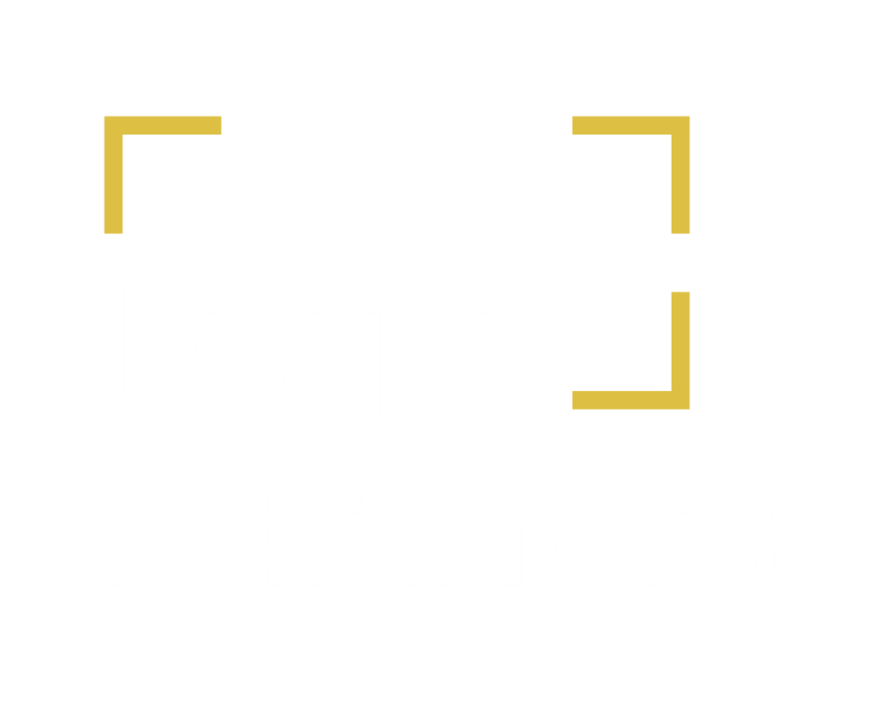

  
  
  
Universidad Peruana de Ciencias Aplicadas  
  
Carrera: Ingeniería de Software  
  
Ciclo: 2025-02  
  
Curso: Fundamentos de Arquitectura de Software   
  
Sección: 1ASI0657 
  
Profesor: Jorge Luis Delgado Vite 
  
Informe del Trabajo Final - TP
  
Startup: Law Connect
  
Producto: Law Connect

### Team Members:

| Member                                | Code       |
|---------------------------------------|------------|
| Paitan Pumacahua, Max Anthony         | U201324454 |
| Conde Isla, Camila Alessandra       | U202114309 |
| Pariona Lucas, Jose Manuel         | UXXXXXXXXX |
| Méndez Vargas, Sebastian       | UXXXXXXXXX |
| Góngora Sánchez, Marco Antonio          | U20211A085 |

  
**Setiembre del 2025**

  
---  
# Registro de Versiones del Informe  

  
| Versión | Fecha      | Autor   | Descripción de modificaciones         |
|---------|------------|---------|---------------------------------------|
| 1.0     | xx/09/2025 | Paitan Pumacahua, Max Anthony  	Conde Isla, Camila Alessandra	  Pariona Lucas, Jose Manuel	  Méndez Vargas, Sebastian   Góngora Sánchez, Marco Antonio | Capítulo I   Capítulo II   Capítulo III       |

---  
# Project Report Collaboration Insights  

TB1:

Durante la realizacion del informe ...

Contribuciones del equipo

**Imágen de las contribuciones Max:**

**Imágen de los commits Max:**

**Imágen de las contribuciones Camila:**

**Imágen de los commits Camila:**

**Imágen de las contribuciones Jose:**

**Imágen de los commits Jose:**

**Imágen de las contribuciones Sebastian:**

**Imágen de los commits Sebastian:**

**Imágen de las contribuciones Marco:**

**Imágen de los commits Marco:**

---  
# Student Outcome  
El curso contribuye al cumplimiento del Student Outcome ABET: **ABET – EAC - Student Outcome X**   Criterio:   
  
En el siguiente cuadro se describe las acciones realizadas y enunciados de conclusiones por parte del grupo, que permiten sustentar el haber alcanzado el logro del ABET – EAC - Student Outcome X.  

| Criterio específico | Acciones realizadas | Conclusiones |
| - | - | - |
| Criterio 1 | ***TB1:***   **Paitan Pumacahua, Max Anthony**   ...   **Conde Isla, Camila Alessandra**   ...    **Pariona Lucas, Jose Manuel**   ...      **Méndez Vargas, Sebastian**   ...      **Góngora Sánchez, Marco Antonio**   ...   | En conclusión, ... |  
| Criterio 2 | ***TB1:***   **Paitan Pumacahua, Max Anthony**   ...   **Conde Isla, Camila Alessandra**   ...    **Pariona Lucas, Jose Manuel**   ...      **Méndez Vargas, Sebastian**   ...      **Góngora Sánchez, Marco Antonio**   ...   | En conclusión, ... |
---  
# Contenido  
## Tabla de contenidos  
  
### [Capítulo I: Introducción]()  
- [1.1. Startup Profile]()  
  - [1.1.1 Descripción de la Startup]()  
  - [1.1.2 Perfiles de integrantes del equipo]()  
- [1.2 Solution Profile]()  
  - [1.2.1 Law Connect]()
  - [1.2.2 Antecedentes y problemática]()  
  - [1.2.3 Lean UX Process]()  
      - [1.2.3.1. Lean UX Problem Statements](h)  
      - [1.2.3.2. Lean UX Assumptions]()  
      - [1.2.3.3. Lean UX Hypothesis]()  
      - [1.2.3.4. Lean UX Canvas]()  
- [1.3. Segmentos objetivo]()  
  
### [Capítulo II: Requirements Elicitation & Analysis]()  
- [2.1. Competidores]()  
  - [2.1.1. Análisis competitivo]()  
  - [2.1.2. Estrategias y tácticas frente a competidores]()  
- [2.2. Entrevistas]()  
  - [2.2.1. Diseño de entrevistas]()  
  - [2.2.2. Registro de entrevistas]()  
  - [2.2.3. Análisis de entrevistas]()  
- [2.3. Needfinding]()  
  - [2.3.1. User Personas]()  
  - [2.3.2. User Task Matrix]()  
  - [2.3.3. Empathy Maps]()  
  - [2.3.4. As-is Scenario Mapping]()  
  
### [Capítulo III: Requirements Specification]()  
- [3.1. To-Be Scenario Mapping]()  
- [3.2. User Stories]()  
- [3.3. Impact Map]()  
- [3.4. Product Backlog]()  
  
  
---

# Capítulo I: Introducción

## 1.1. Startup Profile

### 1.1.1 Descripción de la Startup

<!-- contenido -->

### 1.1.2 Perfiles de integrantes del equipo

<!-- contenido -->

## 1.2. Solution Profile

### 1.2.1 Law Connect

<!-- contenido -->

### 1.2.2 Antecedentes y problemática

<!-- contenido -->

### 1.2.3. Lean UX Process

#### 1.2.3.1. Lean UX Problem Statements

<!-- contenido -->

#### 1.2.3.2. Lean UX Assumptions

<!-- contenido -->

#### 1.2.3.3. Lean UX Hypothesis

<!-- contenido -->

#### 1.2.3.4. Lean UX Canvas

<!-- contenido -->

## 1.3. Segmentos objetivo

<!-- contenido -->

---

# Capítulo II: Requirements Elicitation & Analysis

## 2.1. Competidores

<table style="width:100%; border-collapse:collapse; table-layout:fixed; font-size:14px;">
  <colgroup>
    <col style="width:22%">
    <col style="width:56%">
    <col style="width:22%">
  </colgroup>
  <thead>
    <tr>
      <th style="border:1px solid #444; padding:8px;">EMPRESA</th>
      <th style="border:1px solid #444; padding:8px;">DESCRIPCIÓN</th>
      <th style="border:1px solid #444; padding:8px;">IMAGEN</th>
    </tr>
  </thead>
  <tbody>
    <tr>
      <td style="border:1px solid #444; padding:12px; vertical-align:top;"><strong>Legalo.pe</strong></td>
      <td style="border:1px solid #444; padding:12px;">Marketplace peruano que conecta usuarios con abogados especializados por especialidad y ciudad; permite publicar casos y contactar especialistas, priorizando rapidez y una experiencia de contratación segura.</td>
      <td style="border:1px solid #444; padding:12px; text-align:center;">
        
      </td>
    </tr>
    <tr>
      <td style="border:1px solid #444; padding:12px; vertical-align:top;"><strong>Aboga.pe</strong></td>
      <td style="border:1px solid #444; padding:12px;">Estudio jurídico peruano que ofrece consulta directa en diversas especialidades y, cuando corresponde, deriva internamente al abogado idóneo. Capta y atiende por web, Facebook, teléfono y WhatsApp.</td>
      <td style="border:1px solid #444; padding:12px; text-align:center;">
        
      </td>
    </tr>
    <tr>
      <td style="border:1px solid #444; padding:12px; vertical-align:top;"><strong>Legal Partners Peru</strong></td>
      <td style="border:1px solid #444; padding:12px;">Marketplace automatizado que integra abogados, notarías y centros de conciliación para resolver trámites de principio a fin, facilitando el contacto y el seguimiento en línea.</td>
      <td style="border:1px solid #444; padding:12px; text-align:center;">
        
      </td>
    </tr>
  </tbody>
</table>

### 2.1.1. Análisis competitivo

<table style="width:100%; border-collapse:collapse; table-layout:fixed; font-size:14px;">
  <colgroup>
    <col style="width:22%">
    <col style="width:22%">
    <col style="width:14%">
    <col style="width:14%">
    <col style="width:14%">
    <col style="width:14%">
  </colgroup>
  <thead>
    <tr>
      <th style="border:1px solid #444; padding:8px;">¿Por qué llevar a cabo este análisis?</th>
      <th style="border:1px solid #444; padding:8px;" colspan="5">¿Qué priorizar para diferenciarnos y afinar nuestra salida al mercado sabiendo la posición de Law Connect frente a los principales competidores?</th>
    </tr>
    <tr>
      <th style="border:1px solid #444; padding:8px;">(En la cabecera colocar por cada competidor nombre y logo)</th>
      <th style="border:1px solid #444; padding:8px;">Criterio</th>
      <th style="border:1px solid #444; padding:8px;">
        

          
          Law Connect
        

      </th>
      <th style="border:1px solid #444; padding:8px;">
        

          
          Legalo.pe
        

      </th>
      <th style="border:1px solid #444; padding:8px;">
        

          
          Aboga.pe
        

      </th>
      <th style="border:1px solid #444; padding:8px;">
        

          
          Legal Partners Peru
        

      </th>
    </tr>
  </thead>
  <tbody>
    <tr>
      <td style="border:1px solid #444; padding:8px; vertical-align:top;" rowspan="2"><strong>Perfil</strong></td>
      <td style="border:1px solid #444; padding:8px;"><em>Overview</em></td>
      <td style="border:1px solid #444; padding:8px;">Marketplace peruano para conectar personas con abogados calificados. Perfiles con credenciales y reseñas, comunicación integrada (chat/videollamada), agenda y gestión de documentos.</td>
      <td style="border:1px solid #444; padding:8px;">Marketplace jurídico para buscar–contactar–contratar abogados; la plataforma intermedia y no presta servicios legales directamente. Foco en rapidez y experiencia segura.</td>
      <td style="border:1px solid #444; padding:8px;">Estudio jurídico peruano que atiende directamente a clientes en diversas especialidades. Ofrece consulta y, cuando es necesario, deriva internamente al abogado más adecuado mediante sus canales web y telefónicos.</td>
      <td style="border:1px solid #444; padding:8px;">Marketplace automatizado que conecta a personas y negocios con abogados; integra además notarías y centros de conciliación para trámites conexos.</td>
    </tr>
    <tr>
      <td style="border:1px solid #444; padding:8px;"><em>Ventaja competitiva — ¿Qué valor ofrece a los clientes?</em></td>
      <td style="border:1px solid #444; padding:8px;">Transparencia (credenciales y valoraciones verificadas), confianza y facilidad de contratación end-to-end (chat/llamadas, citas y documentos) con foco en abogados independientes y acceso democrático.</td>
      <td style="border:1px solid #444; padding:8px;">Contratación ágil de especialistas; reglas claras de intermediación y funciones de mediación de disputas para dar confianza en la transacción.</td>
      <td style="border:1px solid #444; padding:8px;">Respuesta rápida con consulta directa y acompañamiento; derivación interna al especialista cuando el caso lo requiere, con atención por web, teléfono y redes.</td>
      <td style="border:1px solid #444; padding:8px;">Cobertura ampliada del “viaje legal” (abogados + notarías + conciliación) y automatización del flujo de conexión, reduciendo fricciones y tiempos.</td>
    </tr>
    <tr>
      <td style="border:1px solid #444; padding:8px; vertical-align:top;" rowspan="2"><strong>Perfil de Marketing</strong></td>
      <td style="border:1px solid #444; padding:8px;">Mercado objetivo</td>
      <td style="border:1px solid #444; padding:8px;">Personas que buscan asesoría legal confiable y transparente para resolver casos frecuentes como familia, laboral y contratos, y abogados recién egresados o independientes que necesitan visibilidad y clientes estables.</td>
      <td style="border:1px solid #444; padding:8px;">Personas que desean contratar con rapidez a un abogado por especialidad y ciudad, y abogados independientes que buscan captar casos de forma ágil.</td>
      <td style="border:1px solid #444; padding:8px;">Personas con urgencia legal o dudas sobre si requieren abogado, que valoran orientación inmediata y derivación interna al especialista por web o teléfono.</td>
      <td style="border:1px solid #444; padding:8px;">Personas y pequeñas empresas que necesitan resolver trámites integrales con menor fricción, integrando abogado, notaría y conciliación en un solo flujo.</td>
    </tr>
    <tr>
      <td style="border:1px solid #444; padding:8px;">Estrategias de marketing</td>
      <td style="border:1px solid #444; padding:8px;">Law Connect emplea marketing digital para captar clientes y realiza campañas dirigidas a colegios de abogados y asociaciones profesionales para atraer oferta, complementando la promoción con presencia en canales online propios.</td>
      <td style="border:1px solid #444; padding:8px;">Legalo se promociona en redes sociales como Instagram (@legalo.pe) y a través de su sitio web, donde invita a publicar casos y contactar especialistas, combinando contenido informativo y llamadas a la acción para captar clientes y abogados.</td>
      <td style="border:1px solid #444; padding:8px;">Aboga.pe impulsa tráfico mediante su sitio y blog con contenidos legales y refuerza la captación por redes sociales como Facebook (ABOGA PERU SAC), además de habilitar contacto directo por teléfono y WhatsApp para consultas.</td>
      <td style="border:1px solid #444; padding:8px;">Legal Partners Peru comunica su propuesta de marketplace automatizado en Facebook y utiliza publicaciones y actualizaciones para atraer usuarios y aliados, orientando el flujo hacia el contacto y la búsqueda de servicios dentro de su red.</td>
    </tr>
    <tr>
      <td style="border:1px solid #444; padding:8px; vertical-align:top;" rowspan="3"><strong>Perfil de Producto</strong></td>
      <td style="border:1px solid #444; padding:8px;">Productos &amp; Servicios</td>
      <td style="border:1px solid #444; padding:8px;">Ofrece búsqueda por especialidad y ubicación, perfiles con credenciales y calificaciones verificadas, comunicación integrada por chat y videollamadas, gestión de citas y documentos, y pagos en plataforma con verificación de identidad y título.</td>
      <td style="border:1px solid #444; padding:8px;">Directorio y marketplace por especialidad y ciudad con flujo de buscar, contactar y contratar, manteniendo un contacto intermedio; la plataforma no brinda asesoría legal directa.</td>
      <td style="border:1px solid #444; padding:8px;">Ofrece consulta legal y atención directa por sus abogados; cuando el caso lo requiere, realiza derivación interna al especialista correspondiente. Atiende por web, teléfono y WhatsApp.</td>
      <td style="border:1px solid #444; padding:8px;">Conecta con abogados e integra el viaje legal con notarías y centros de conciliación, automatizando la conexión y la derivación para reducir fricciones.</td>
    </tr>
    <tr>
      <td style="border:1px solid #444; padding:8px;">Precios &amp; Costos</td>
      <td style="border:1px solid #444; padding:8px;">Modelo de ingresos basado en comisión por cada contratación realizada dentro de la plataforma, complementado con planes premium para abogados que ofrecen mayor visibilidad y herramientas adicionales, y con potenciales alianzas con instituciones educativas.</td>
      <td style="border:1px solid #444; padding:8px;">Probable combinación de comisión por caso y/o suscripción para abogados, mientras que el cliente paga honorarios por servicio con tarifas visibles por tipo de caso.</td>
      <td style="border:1px solid #444; padding:8px;">Consulta inicial a precio fijo complementada con los honorarios del abogado derivado, con un posible fee de intermediación en las derivaciones.</td>
      <td style="border:1px solid #444; padding:8px;">Honorarios por servicio más costos de trámites notariales o de conciliación, con la opción de comisión o suscripción para profesionales aliados.</td>
    </tr>
    <tr>
      <td style="border:1px solid #444; padding:8px;">Canales de distribución (Web y/o Móvil)</td>
      <td style="border:1px solid #444; padding:8px;">Plataforma web responsive para móvil y desktop con videollamada en el navegador; en el roadmap, evaluar una app móvil según la adopción de los usuarios.</td>
      <td style="border:1px solid #444; padding:8px;">Web como canal principal con autoservicio de búsqueda y contratación.</td>
      <td style="border:1px solid #444; padding:8px;">Web complementada con atención por teléfono y WhatsApp para una derivación rápida desde los leads móviles.</td>
      <td style="border:1px solid #444; padding:8px;">Web con formularios por trámite y coordinación en línea con notarías y centros aliados para completar el proceso.</td>
    </tr>
    <tr>
      <td style="border:1px solid #444; padding:8px; vertical-align:top;" rowspan="4"><strong>Análisis SWOT</strong> <small>Nota: fortalezas/debilidades = factores internos; oportunidades/amenazas = factores externos.</small></td>
      <td style="border:1px solid #444; padding:8px;">Fortalezas</td>
      <td style="border:1px solid #444; padding:8px;">Flujo end-to-end con perfiles verificados, agenda, chat/videollamada y pagos integrados, reforzado por transparencia de credenciales y reseñas; enfoque en MYPE y consumidor con tickets claros (por ejemplo, primera consulta a precio fijo), base para captación orgánica por SEO long-tail y arquitectura preparada para integrar verificación de identidad/KYC y gestión de documentos.</td>
      <td style="border:1px solid #444; padding:8px;">Posicionamiento como marketplace jurídico local con proceso de búsqueda–contacto–contratación simple y buen alcance SEO por especialidad y ciudad.</td>
      <td style="border:1px solid #444; padding:8px;">Respuesta rápida y consulta directa multicanal; cercanía y acompañamiento humano en casos urgentes, con derivación interna al especialista cuando aplica.</td>
      <td style="border:1px solid #444; padding:8px;">Propuesta de trámite integral que articula abogados, notarías y conciliación, apoyada por automatización del flujo de derivación y una red de aliados.</td>
    </tr>
    <tr>
      <td style="border:1px solid #444; padding:8px;">Debilidades</td>
      <td style="border:1px solid #444; padding:8px;">Marca nueva con menor confianza inicial frente a incumbentes, reto de equilibrio oferta–demanda propio de los marketplaces, cobertura geográfica aún limitada fuera de Lima y necesidad de moderación/verificación continua que añade costo operativo.</td>
      <td style="border:1px solid #444; padding:8px;">Menor profundidad end-to-end en agenda, comunicación y pagos integrados, posible opacidad de precios finales al depender de cada abogado y riesgo de desintermediación tras el primer contacto.</td>
      <td style="border:1px solid #444; padding:8px;">Escalabilidad condicionada si la atención depende de interacción humana, menor autoservicio para comparar opciones y precios y mayor dependencia de canales síncronos como teléfono o WhatsApp.</td>
      <td style="border:1px solid #444; padding:8px;">Complejidad operativa por gestión de alianzas con terceros, experiencia variable según el aliado y tiempos de salida más lentos por la coordinación externa.</td>
    </tr>
    <tr>
      <td style="border:1px solid #444; padding:8px;">Oportunidades</td>
      <td style="border:1px solid #444; padding:8px;">Mayor aceptación de servicios legales online en la región, potencial de SEO orgánico por especialidad y distrito con contenido educativo, bundles para MYPE y startups, integraciones con notarías y mecanismos de mediación/conciliación y uso responsable de IA para pre-briefing y screening.</td>
      <td style="border:1px solid #444; padding:8px;">Profundizar en pagos y agenda integrados para fidelizar, abrir verticales B2B mediante convenios y fortalecer programas de suscripción para la base de abogados.</td>
      <td style="border:1px solid #444; padding:8px;">Escalar la captación con automatización de pre‑diagnóstico 24/7, reforzar contenido educativo de diagnóstico y cerrar alianzas con marcas afines para referidos.</td>
      <td style="border:1px solid #444; padding:8px;">Paquetes integrales para empresas e inmobiliarias, digitalización acelerada de notarías y conciliación como ventaja competitiva y automatización del seguimiento documental mediante integraciones y APIs.</td>
    </tr>
    <tr>
      <td style="border:1px solid #444; padding:8px;">Amenazas</td>
      <td style="border:1px solid #444; padding:8px;">Cambios regulatorios en intermediación y protección de datos, desintermediación entre cliente y abogado fuera de la plataforma, entrada de incumbentes o actores globales y presiones competitivas que deriven en guerra de precios.</td>
      <td style="border:1px solid #444; padding:8px;">Competidores con experiencia end-to-end superior, ajustes regulatorios sobre publicidad y captación de servicios legales y baja diferenciación que facilita el cambio de proveedor.</td>
      <td style="border:1px solid #444; padding:8px;">Dificultades para escalar operaciones ante picos de demanda, migración de usuarios hacia autoservicio o contacto directo con abogados y mayores exigencias de compliance en datos sensibles por atención multicanal.</td>
      <td style="border:1px solid #444; padding:8px;">Dependencia de terceros como notarías y centros ante cambios regulatorios u operativos, posibles competidores con integraciones propias más rápidas y cuellos de botella en temporadas de alta demanda.</td>
    </tr>
  </tbody>
</table>

### 2.1.2. Estrategias y tácticas frente a competidores

Entre las principales estrategias y tácticas que ejecutaremos como Law Connect son las siguientes:

1) **Precio claro y atractivo.** Mostraremos la primera consulta a precio fijo y sin letras chicas. Así cualquiera sabrá cuánto pagará desde el inicio y podrá comparar fácilmente.

2) **Rapidez y comodidad.** Responderemos en minutos, con agenda y videollamada en la misma plataforma para evitar idas y vueltas por WhatsApp o teléfono.

3) **Escuchar y mejorar.** Después de cada caso haremos encuestas cortas y un pequeño “buzón de ideas”. Las mejoras más pedidas por los usuarios se priorizarán en nuestro producto.

4) **Confianza ante todo.** Abogados verificados, perfiles con reseñas visibles y apoyo si algo sale mal (mediación y políticas claras). Esto reduce el miedo a contratar en línea.

5) **Alianzas que sumen.** Buscaremos acuerdos con colegios de abogados, universidades y notarías en distritos clave para ampliar oferta y facilitar trámites cuando haga falta.

6) **Promociones simples.** Descuentos de bienvenida en la primera consulta, código de referidos para clientes y reconocimiento a abogados con mejor tiempo de respuesta y calificaciones.

7) **Contenido útil que atrae.** Publicaremos guías sencillas “qué hacer si…” (familia, laboral, contratos) y resolveremos dudas comunes en redes. Esto ayuda a que nos encuentren por Google y a construir confianza.

8) **Planes para negocios pequeños.** Ofreceremos paquetes para MYPE/startups (documentos básicos + horas de consulta al mes) y recordatorios cuando necesiten renovar o actualizar algo.

Cómo nos diferenciamos:
- Frente a **Legalo.pe**: destacaremos *precios visibles y respuesta rápida con pagos/agenda dentro de la plataforma.
- Frente a **Aboga.pe**: daremos una opción más autoservicio (comparar y elegir en línea) sin depender de llamadas.
- Frente a **Legal Partners Peru**: iremos simple y rápido en lo principal, sumando notarías/conciliación solo cuando aporte valor real.

## 2.2. Entrevistas

### 2.2.1. Diseño de entrevistas

#### Segmento objetivo 1: 

##### Preguntas Generales

- ¿Con qué frecuencia necesita servicios legales?  
- ¿Cómo describiría su experiencia general al buscar asesoría legal?  
- ¿Qué medios utiliza habitualmente para informarse sobre cuestiones legales? Preguntas Específicas  
- ¿Qué características considera esenciales en una plataforma digital para buscar asistencia legal?  
- ¿Qué dificultades ha encontrado al usar plataformas en línea para asuntos legales?  
- ¿Cómo prefiere comunicarse con un abogado? ¿a través de una plataforma digital? ¿Chat en vivo, email, llamadas telefónicas?  
- ¿Hay algún servicio adicional que le gustaría que ofreciera una plataforma de asistencia legal que no haya visto disponible actualmente?  

#### Segmento objetivo 2: 

##### Preguntas Generales

- ¿Qué recursos ha encontrado más útiles en su búsqueda de empleo hasta ahora?
- ¿Qué desafíos específicos enfrenta al buscar oportunidades laborales en el campo legal?
- ¿Cómo se mantiene actualizado con las tendencias y cambios en el ámbito legal?

##### Preguntas Específicas

- ¿Qué herramientas digitales considera importantes en una plataforma de empleo para abogados?
- ¿Qué tipo de apoyo o recursos espera de una plataforma que conecta abogados con clientes?
- ¿Cómo evalúa las oportunidades de trabajo en términos de desarrollo profesional y estabilidad financiera?
- ¿Qué funcionalidades adicionales facilitarían su labor diaria como abogado al usar nuestra plataforma?
- ¿Considera importante la capacitación continua ofrecida por la plataforma? ¿Qué tipo de cursos o formaciones le gustaría recibir?

### 2.2.2. Registro de entrevistas

**Segmento Objetivo 1: Personas con Problemas Legales**
 
Entrevista 1: José Carlos usa servicios legales 1 o 2 veces al año y hoy se frustra por precios poco claros, difícil comparación y respuestas lentas (además lo sacan a WhatsApp). Quiere ver precios desde el inicio, filtrar por especialidad y ubicación, agendar y pagar en la misma plataforma, chatear primero y luego tener una videollamada breve. También valora seguimiento del caso, reseñas verificadas y respaldo si algo sale mal. En resumen, busca claridad de costos, rapidez y confianza.
 

Enlace de la entrevista: https://drive.google.com/file/d/1A09aChTQTjvrbhOoIHXFjrR_yuGJpiNw/view?usp=drive_link  

 
Entrevista 2: Genaro Ledesma comentó que recurre a servicios legales solo de manera esporádica, aproximadamente una vez al año, en casos como contratos de alquiler o trámites de papeleo. Señaló que la búsqueda de asesoría legal suele ser complicada, ya que muchas veces no sabe dónde acudir y la información en internet no siempre es clara ni confiable. Indicó que suele informarse principalmente en Google, foros y con ChatGPT, además de preguntar a familiares o amigos. Respecto a una plataforma digital, resaltó que sería esencial que fuera fácil de usar, que permita filtrar abogados por características específicas, ver reseñas de clientes y consultar disponibilidad. Mencionó que ha encontrado dificultades como falta de información confiable sobre los abogados y demoras en la comunicación. Prefiere comunicarse primero por chat en vivo, aunque considera que llamadas o reuniones presenciales son mejores para casos más serios. Finalmente, manifestó interés en que la plataforma ofrezca una asesoría rápida inicial y un estimado de costos desde el comienzo para evitar sorpresas.
 

Enlace de la entrevista: https://drive.google.com/file/d/1ES7jm2IHyqYFqf6ZRW8h3tzxbntpQFEO/view?usp=sharing

 
Entrevista 3: Nelida Ruiz en una persona que se dedica al alquiler de departamentos que cada seis meses a un año necesita los servicios de un abogado. Su experiencia es mala ya que no encuentra con un abogado que cumpla con sus expectativas, además debe buscar alguno por Facebook o según las recomendaciones de sus conocidos. Lo más importante para ella es que los abogados sean responsables, confiables y que cuenten con referencias para poder contratarlos. En las plataformas se le dificulta encontrar asesoría legal ya que no hay una que sea específica para el rubro. También nos dicen que prefiere los chats en vivo para una atención más personalizada y poder tener un seguimiento del caso.
 

Enlace de la entrevista: https://drive.google.com/file/d/1ES7jm2IHyqYFqf6ZRW8h3tzxbntpQFEO/view?usp=sharing 

**Segmento Objetivo 2: Abogados Buscando Expandir su Clientela**
 
Entrevista 4: Víctor comentó las dificultades que experimenta en su labor como abogado independiente, principalmente en aspectos de promoción y en la organización de su cartera de clientes. Manifestó interés en contar con una plataforma que le proporcione herramientas completas para administrar sus casos, agendar reuniones y facilitar la comunicación con sus clientes. Destacó que le resultaría muy valioso disponer de funciones que fortalezcan la interacción y la personalización, como recordatorios automáticos o la posibilidad de enviar actualizaciones sobre el estado de los procesos directamente desde la aplicación.
 

Enlace de la entrevista: https://youtu.be/SlU9ImxNps4

 
Entrevista 5: Jonathan, quien es relativamente nuevo en la búsqueda de servicios legales, destacó la necesidad de un acceso fácil y directo a asesoría legal. Valora una interfaz intuitiva que simplifique el proceso para aquellos no familiarizados con el sistema legal. Propuso que la aplicación debería tener funcionalidades que eduquen al usuario sobre el proceso legal básico y cómo proceder en distintos escenarios legales. Jonathan también mencionó la importancia de tener opciones de soporte al cliente en la plataforma para resolver cualquier duda que pueda surgir durante el proceso.
   

  

Enlace de la entrevista: https://www.youtube.com/watch?v=zcJc5LXgo8k

### 2.2.3. Análisis de entrevistas

**Análisis  del segmento objetivo 1 - Personas con Problemas Legales:**

100% de la muestra valora precios visibles, respuesta en minutos y confianza (perfiles verificados, reseñas y respaldo si algo sale mal). Prefiere iniciar por chat y pasar a una videollamada breve, y espera un flujo de inicio a fin: buscar, comparar, agendar, pagar y dar seguimiento en la misma plataforma. Sus principales dolores son precios opacos y demoras; se informa sobre temas legales por Google, redes/videos cortos y referencias.

**Análisis  del segmento objetivo 2 - Abogados Buscando Expandir su Clientela:**
 

El análisis del segmento de abogados muestra que el 100 % de los entrevistados ve valor en contar con una solución digital que facilite su trabajo y la relación con clientes. El 50 % (Víctor) enfrenta dificultades en la promoción y en la organización de su cartera, por lo que demanda una plataforma que centralice la gestión de casos, agende reuniones y envíe recordatorios automáticos o actualizaciones sobre procesos. El otro 50 % (Jonathan) pone énfasis en la necesidad de que la herramienta sea intuitiva y educativa, permitiendo guiar a usuarios poco familiarizados con el sistema legal y brindando soporte en línea para resolver dudas. En conjunto, ambos coinciden en que una aplicación integral con funciones de gestión, comunicación y apoyo al cliente sería clave para optimizar su ejercicio profesional.

## 2.3. Needfinding

En esta sección se presentarán los artefactos resultantes del proceso de análisis de la información recolectada de los segmentos objetivos.

### 2.3.1. User Personas

En esta sección, mostramos perfiles ficticios que representan a los segmentos de usuarios identificados y entrevistados. Incluimos detalles sobre su demografía, personalidad, motivaciones, preferencias, objetivos, desafíos y comportamientos, además de cómo interactúan con productos similares. Estos datos se basan en las entrevistas realizadas y se han organizado utilizando la herramienta UXPressia.

**User Persona: Abogado**

**User Persona: Cliente que busca asesoría legal**

### 2.3.2. User Task Matrix
En esta sección se presenta la matriz de tareas del usuario (User Task Matrix), una herramienta enfocada en los segmentos objetivo que permite identificar las acciones clave y necesidades específicas de cada tipo de usuario. Esta matriz facilita la priorización de funcionalidades dentro del product backlog, alineando el desarrollo con lo que realmente aporta valor. Para evaluar cada tarea, se consideran dos dimensiones: la frecuencia de uso (alta, media, baja) y su nivel de importancia (alta, media, baja).

<!-- contenido -->

### 2.3.3. Empathy Maps

Esta sección introduce el Empathy Mapping como una herramienta clave para construir perfiles detallados de los User Personas y profundizar en la comprensión de sus percepciones, emociones y comportamientos. Los diagramas fueron elaborados utilizando la plataforma UXPressia, lo que permitió visualizar de forma clara y estructurada la experiencia del usuario.

<!-- contenido -->
**Empathy Map: Abogado**

**Empathy Map: Cliente**

### 2.3.4. As-Is Scenario Mapping
Esta sección expone los mapeos de escenarios As-Is para ambos segmentos objetivo, con el propósito de identificar y analizar los puntos de interacción actuales entre los usuarios y el sistema. Este ejercicio permite comprender cómo se relacionan con la plataforma en su estado actual, revelando oportunidades de mejora en la experiencia y funcionalidad.
<!-- contenido -->
**As-Is Abogado**

**As-Is Cliente**

---

# Capítulo III: Requirements Specification

## 3.1. To-Be Scenario Mapping

<!-- contenido -->

## 3.2. User Stories

| **Epic / User Story ID** | **Título** | **Descripción** | **Criterios de Aceptación** | **Relacionado con (Epic ID)** |
|-------------------------:|------------|-----------------|-----------------------------|-------------------------------|
|           ...            |     ...    |       ...       |              ...            |              ...              |

## 3.3. Impact Map

<!-- contenido -->

## 3.4. Product Backlog

| **# Orden** | **User Story Id** | **Título** | **Descripción** | **Story Points (1 / 2 / 3 / 5 / 8)** |
|------------:|-------------------|------------|-----------------|--------------------------------------|
| X           | EX - US00X        | ...        | **Como** ...   **Quiero** ...   **Para** ... | X |

---

# Conclusiones

### Conclusiones y recomendaciones

<!-- contenido -->

### Video About-the-Team

<!-- enlace/video -->

---

# Bibliografía

<!-- referencias -->

---

# Anexos

<!-- anexos -->
